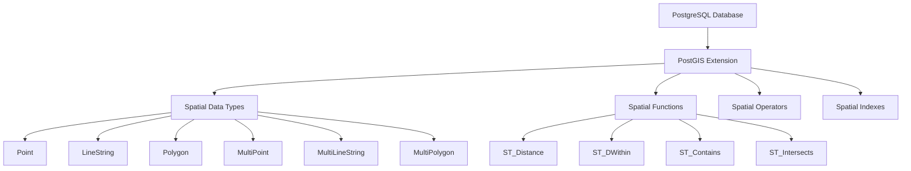
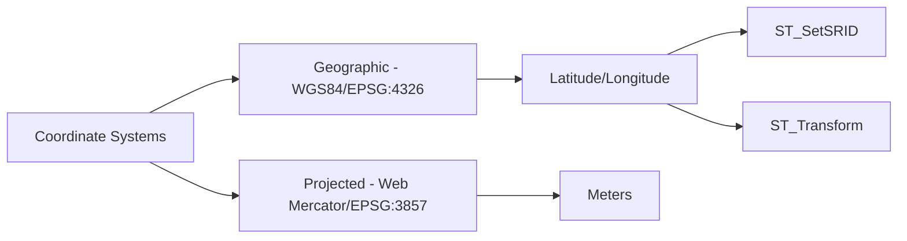
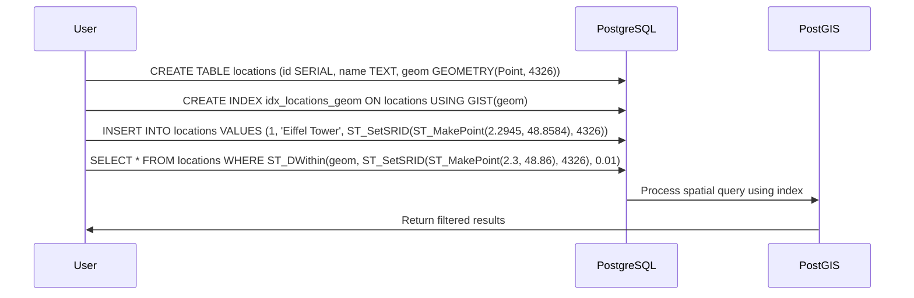
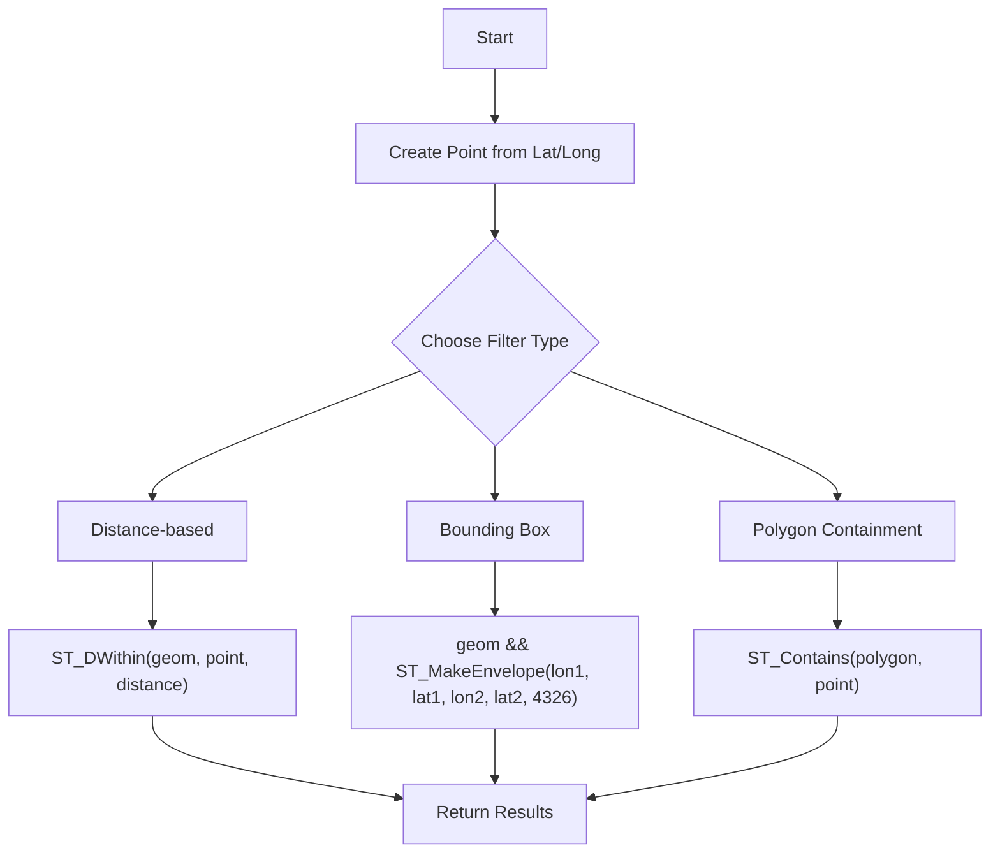
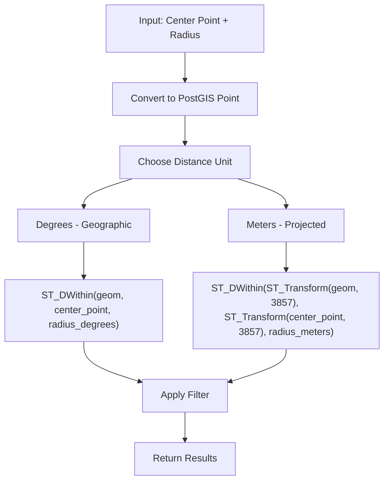
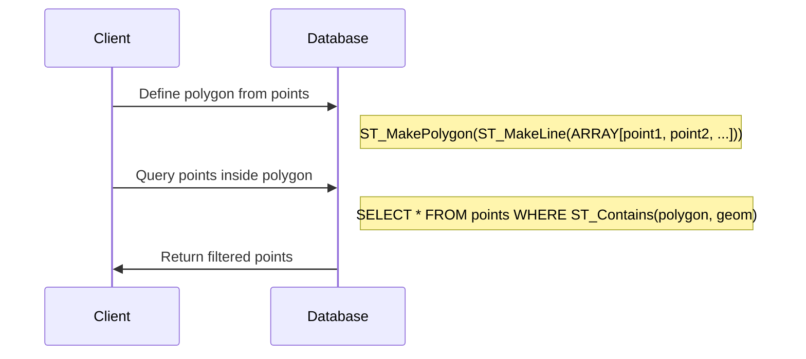
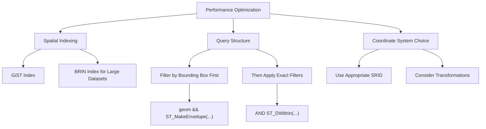
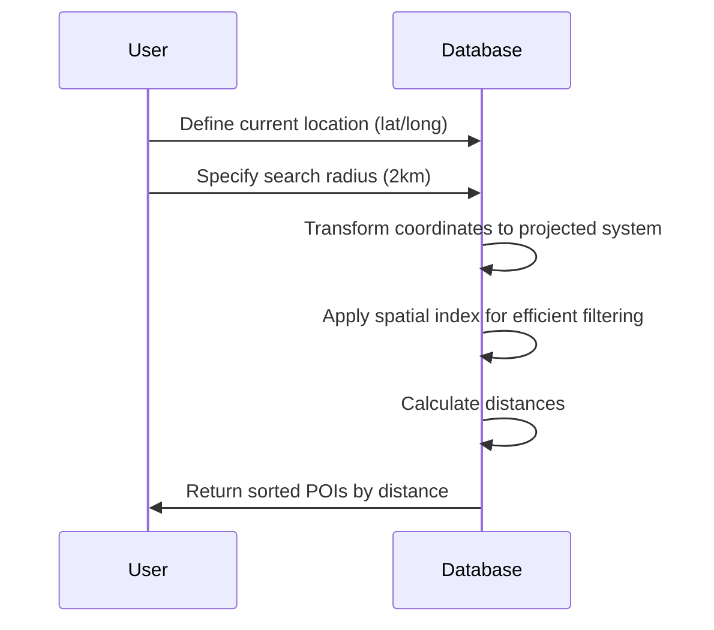
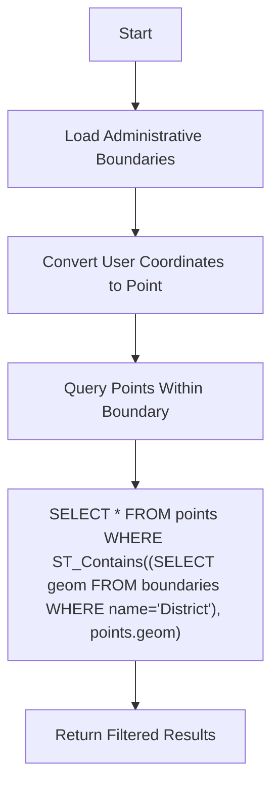

# Filtering Geospatial Data with PostGIS: A Comprehensive Guide

## Introduction

This document explains the logic and implementation of geospatial filtering using PostGIS with latitude and longitude coordinates. We'll explore different filtering techniques, optimization strategies, and practical examples with visual diagrams.

## Table of Contents

1. [PostGIS Fundamentals](#postgis-fundamentals)
2. [Coordinate Systems and Spatial References](#coordinate-systems)
3. [Creating Spatial Indexes](#spatial-indexes)
4. [Basic Point Filtering](#basic-point-filtering)
5. [Advanced Filtering Techniques](#advanced-filtering)
6. [Performance Optimization](#performance-optimization)
7. [Real-world Examples](#real-world-examples)

## PostGIS Fundamentals

PostGIS extends PostgreSQL with geospatial capabilities. Let's understand the core components:



## Coordinate Systems and Spatial References



## Creating Spatial Indexes



## Basic Point Filtering



## Advanced Filtering Techniques

### Radius Search



### Polygon Filtering



## Performance Optimization



## Real-world Examples

### Finding Nearby Points of Interest

```sql
-- Create a spatial table
CREATE TABLE pois (
    id SERIAL PRIMARY KEY,
    name TEXT,
    category TEXT,
    geom GEOMETRY(Point, 4326)
);

-- Add spatial index
CREATE INDEX idx_pois_geom ON pois USING GIST(geom);

-- Insert some data
INSERT INTO pois (name, category, geom) VALUES
    ('Eiffel Tower', 'landmark', ST_SetSRID(ST_MakePoint(2.2945, 48.8584), 4326)),
    ('Louvre Museum', 'museum', ST_SetSRID(ST_MakePoint(2.3376, 48.8606), 4326)),
    ('Notre-Dame', 'religious', ST_SetSRID(ST_MakePoint(2.3499, 48.8530), 4326));

-- Find POIs within 2km of a point
SELECT name, category, 
       ST_Distance(
           ST_Transform(geom, 3857),
           ST_Transform(ST_SetSRID(ST_MakePoint(2.3, 48.86), 4326), 3857)
       ) AS distance_meters
FROM pois
WHERE ST_DWithin(
    ST_Transform(geom, 3857),
    ST_Transform(ST_SetSRID(ST_MakePoint(2.3, 48.86), 4326), 3857),
    2000
)
ORDER BY distance_meters;
```



### Filtering Points Within Administrative Boundaries



## Conclusion

This guide demonstrates the power and flexibility of PostGIS for geospatial filtering using latitude and longitude coordinates. By leveraging spatial indexes and appropriate query techniques, you can efficiently filter and analyze location data for various applications.

## Implementation in Our Project

In our matching service, we've implemented geospatial filtering using PostGIS to find job listings within a specified radius of a location. The implementation:

1. Uses the `ST_DWithin` function to find jobs within a radius of a given point
2. Accepts latitude, longitude, and radius parameters from the frontend
3. Uses a default radius of 50 kilometers if no radius is specified
4. Optimizes performance with spatial indices
5. Handles both kilometers (radius_km) and meters (radius) units, with meters taking precedence

The core of our implementation is in the `_build_location_filters` method in the `JobQueryBuilder` class, which constructs the SQL query with the appropriate PostGIS functions.