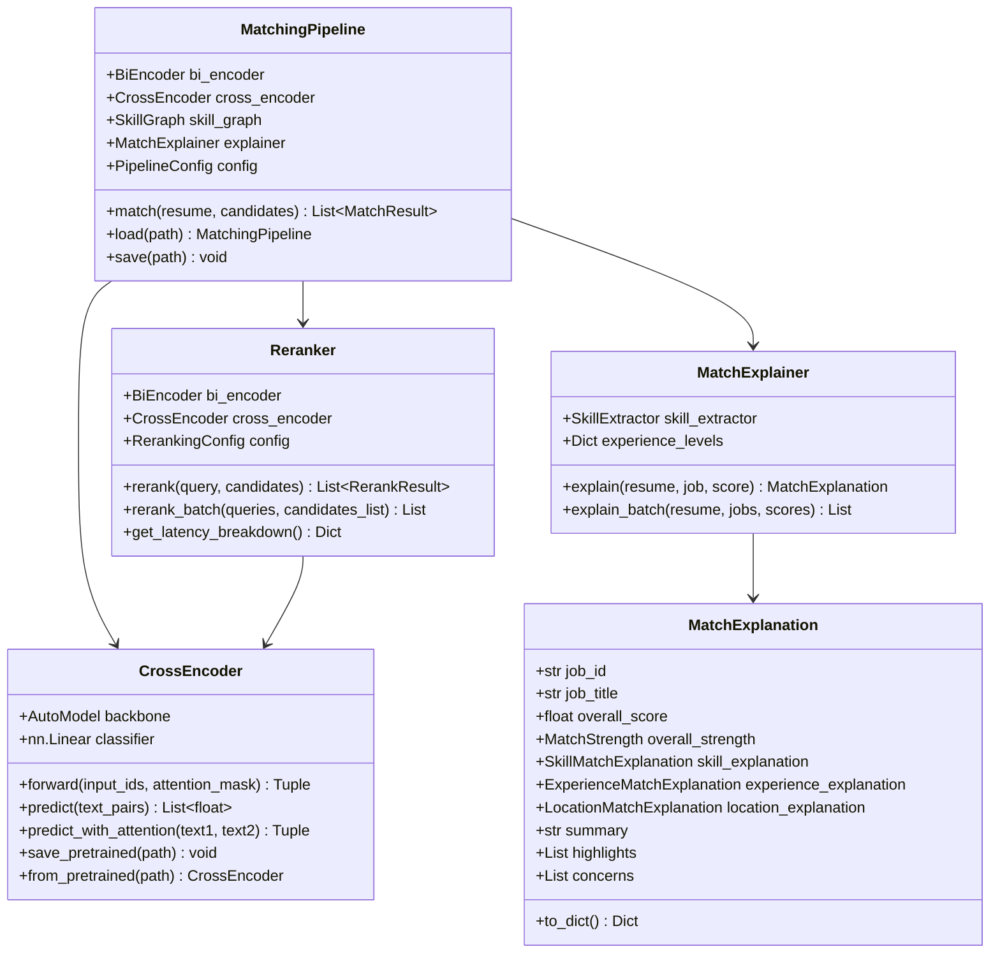

# High-Level Design: Phase 4 - Cross-Encoder Reranking + Explainability

**Version:** 1.0
**Date:** 2025-12-01
**Status:** Implemented
**Authors:** AIgen Engineering Team

---

## Executive Summary

Phase 4 completes the Resonance v2 matching evolution by implementing a **two-stage retrieve-and-rerank architecture** with explainable results. While bi-encoders excel at efficient retrieval, they sacrifice accuracy by encoding texts independently. Cross-encoders solve this by processing the resume-job pair together, enabling cross-attention for significantly higher precision on the top-K candidates.

This phase delivers:
- **CrossEncoder**: Pairwise scoring model with cross-attention
- **Reranker**: Two-stage pipeline orchestrating bi-encoder retrieval → cross-encoder reranking
- **MatchExplainer**: Human-readable explanations for match scores
- **MatchingPipeline**: End-to-end orchestrator integrating all components

**Expected improvement:** +5-10% nDCG@10 on top-25 results (cumulative v2: +25-35%)

---

## Goals and Non-Goals

### Goals
- Maximize precision on top-K results through cross-encoder reranking
- Provide human-readable explanations for match scores
- Maintain P99 latency under 100ms for the full pipeline
- Enable interpretability for end-users (skill gaps, experience match, location fit)
- Support configurable weighting between bi-encoder, cross-encoder, and skill graph scores

### Non-Goals
- Real-time cross-encoder training (batch training only)
- Replacing bi-encoder for initial retrieval (cross-encoders are too slow for full corpus)
- Multi-language explainability (English-first)
- User-facing A/B testing infrastructure (handled separately)

---

## Architecture

### System Context

```
┌─────────────────────────────────────────────────────────────────────────────┐
│                         RESONANCE v2 MATCHING PIPELINE                      │
├─────────────────────────────────────────────────────────────────────────────┤
│                                                                             │
│  ┌──────────┐    ┌─────────────┐    ┌─────────────┐    ┌──────────────┐   │
│  │  Resume  │───▶│ Bi-Encoder  │───▶│  pgvector   │───▶│   Top-100    │   │
│  │   Text   │    │  (Phase 2)  │    │  ANN Search │    │  Candidates  │   │
│  └──────────┘    └─────────────┘    └─────────────┘    └──────┬───────┘   │
│                                                                │           │
│                         ┌──────────────────────────────────────┘           │
│                         │                                                   │
│                         ▼                                                   │
│  ┌──────────────────────────────────────────────────────────────────────┐  │
│  │                    PHASE 4: RERANKING LAYER                          │  │
│  │  ┌────────────────┐    ┌────────────────┐    ┌───────────────────┐  │  │
│  │  │ Cross-Encoder  │───▶│    Reranker    │───▶│  MatchExplainer   │  │  │
│  │  │ (Pairwise)     │    │ (Score Fusion) │    │ (Human-Readable)  │  │  │
│  │  └────────────────┘    └────────────────┘    └───────────────────┘  │  │
│  └──────────────────────────────────────────────────────────────────────┘  │
│                         │                                                   │
│                         ▼                                                   │
│  ┌──────────────────────────────────────────────────────────────────────┐  │
│  │   Top-25 Results with Scores + Explanations                          │  │
│  │   ┌──────────────────────────────────────────────────────────────┐   │  │
│  │   │ {                                                            │   │  │
│  │   │   "job_id": "...",                                          │   │  │
│  │   │   "score": 0.94,                                            │   │  │
│  │   │   "explanation": {                                          │   │  │
│  │   │     "skills": { "matched": ["Python", "AWS"], ... },       │   │  │
│  │   │     "experience": { "score": 0.95 },                        │   │  │
│  │   │     "highlights": ["Matches 5 required skills"],           │   │  │
│  │   │     "concerns": ["Missing Kubernetes experience"]          │   │  │
│  │   │   }                                                         │   │  │
│  │   │ }                                                           │   │  │
│  │   └──────────────────────────────────────────────────────────────┘   │  │
│  └──────────────────────────────────────────────────────────────────────┘  │
│                                                                             │
└─────────────────────────────────────────────────────────────────────────────┘
```

### Component Architecture



---

## Component Details

### 1. CrossEncoder

**Responsibility:** Pairwise scoring with cross-attention for high-precision ranking.

**Why Cross-Encoders?**

| Aspect | Bi-Encoder | Cross-Encoder |
|--------|-----------|---------------|
| Encoding | Texts encoded separately | Texts encoded together |
| Attention | No cross-attention | Full cross-attention |
| Speed | Fast (embeddings cached) | Slow (O(n) forward passes) |
| Accuracy | Good for retrieval | Excellent for ranking |
| Use Case | Initial retrieval (top-100) | Final ranking (top-25) |

**Architecture:**

```python
class CrossEncoder(nn.Module):
    def __init__(self, model_name, max_seq_length=512, num_labels=1):
        self.backbone = AutoModel.from_pretrained(model_name)
        self.classifier = nn.Linear(hidden_size, num_labels)

    def forward(self, input_ids, attention_mask):
        outputs = self.backbone(input_ids, attention_mask, output_attentions=True)
        cls_output = outputs.last_hidden_state[:, 0, :]  # [CLS] token
        scores = torch.sigmoid(self.classifier(cls_output))
        return scores, outputs.attentions
```

**Key Features:**
- Supports any HuggingFace transformer backbone
- Attention weights extraction for interpretability
- Batch inference for efficiency
- Save/load pretrained models

**Location:** `app/ml/models/cross_encoder.py`

---

### 2. Reranker

**Responsibility:** Orchestrate two-stage retrieve-and-rerank pipeline.

**Pipeline Flow:**

```
Resume Text
    │
    ▼
┌─────────────────────────────────────────────────────────────┐
│ Stage 1: Bi-Encoder Retrieval                               │
│ • Encode resume → 1024-dim vector                           │
│ • Encode all candidates → matrix                            │
│ • Compute cosine similarities                               │
│ • Select top-100 candidates                                 │
│ Latency: ~15ms                                              │
└─────────────────────────────────────────────────────────────┘
    │
    ▼
┌─────────────────────────────────────────────────────────────┐
│ Stage 2: Cross-Encoder Reranking                            │
│ • Create (resume, job) pairs for top-100                    │
│ • Batch inference through cross-encoder                     │
│ • Combine scores: 0.7×cross + 0.3×bi                       │
│ • Sort by final score, return top-25                       │
│ Latency: ~50ms                                              │
└─────────────────────────────────────────────────────────────┘
    │
    ▼
Top-25 Ranked Results
```

**Score Fusion:**

```python
final_score = (
    config.cross_encoder_weight * cross_score +  # 0.5
    config.bi_encoder_weight * bi_score +        # 0.3
    config.skill_graph_weight * skill_score      # 0.2
)
```

**Configuration:**

| Parameter | Default | Description |
|-----------|---------|-------------|
| `top_k_retrieve` | 100 | Candidates from bi-encoder |
| `top_k_rerank` | 25 | Final results after reranking |
| `cross_encoder_weight` | 0.5 | Weight for cross-encoder score |
| `bi_encoder_weight` | 0.3 | Weight for bi-encoder score |
| `skill_graph_weight` | 0.2 | Weight for skill graph score |
| `batch_size` | 32 | Batch size for inference |

**Location:** `app/ml/models/reranker.py`

---

### 3. MatchExplainer

**Responsibility:** Generate human-readable explanations for match scores.

**Explanation Components:**

#### Skill Match Analysis

```python
@dataclass
class SkillMatchExplanation:
    matched_skills: List[str]      # Skills in both resume and job
    missing_skills: List[str]       # Required skills not in resume
    related_skills: List[Tuple]     # (resume_skill, job_skill, similarity)
    bonus_skills: List[str]         # Resume skills not required but valuable
    match_score: float
    strength: MatchStrength
```

**Example Output:**
```json
{
  "matched": ["Python", "AWS", "Docker"],
  "missing": ["Kubernetes", "Terraform"],
  "related": [
    {"resume": "Docker", "job": "Kubernetes", "similarity": 0.72}
  ],
  "bonus": ["FastAPI", "PostgreSQL"],
  "score": 0.75
}
```

#### Experience Match Analysis

```python
experience_levels = {
    "internship": 0, "entry": 1, "junior": 1,
    "mid": 2, "senior": 3, "lead": 4,
    "principal": 4, "staff": 4,
    "executive": 5, "director": 5,
    "vp": 6, "c-level": 7
}
```

| Scenario | Score | Strength |
|----------|-------|----------|
| Level meets/exceeds requirement | 1.0 | STRONG |
| One level below requirement | 0.7 | MODERATE |
| Two+ levels below requirement | 0.4 | WEAK |

#### Location Match Analysis

| Scenario | Score | Strength |
|----------|-------|----------|
| Remote job | 1.0 | STRONG |
| Same city | 1.0 | STRONG |
| Same region (Bay Area, NYC metro) | 0.8 | MODERATE |
| Different location | 0.3 | WEAK |

**Match Strength Thresholds:**

```python
def _score_to_strength(score: float) -> MatchStrength:
    if score >= 0.8: return MatchStrength.STRONG
    if score >= 0.5: return MatchStrength.MODERATE
    if score >= 0.2: return MatchStrength.WEAK
    return MatchStrength.MISSING
```

**Location:** `app/ml/models/explainer.py`

---

### 4. MatchingPipeline

**Responsibility:** End-to-end orchestrator integrating all Phase 1-4 components.

**Pipeline Stages:**

| Stage | Component | Latency | Description |
|-------|-----------|---------|-------------|
| 1 | Bi-Encoder | ~15ms | Initial scoring of all candidates |
| 2 | Skill Graph | ~10ms | (Optional) Graph-based enrichment |
| 3 | Cross-Encoder | ~50ms | (Optional) Rerank top-100 |
| 4 | Explainer | ~10ms | (Optional) Generate explanations |
| **Total** | - | **<100ms** | End-to-end latency |

**Feature Flags:**

| Flag | Default | Impact |
|------|---------|--------|
| `use_cross_encoder` | `true` | Enable Stage 3 reranking |
| `use_skill_graph` | `true` | Enable Stage 2 enrichment |
| `use_explainability` | `true` | Enable Stage 4 explanations |

**Location:** `app/ml/pipeline.py`

---

## Configuration

### Environment Variables (MLConfig)

```bash
# Cross-Encoder Settings
ML_CROSS_ENCODER_MODEL=cross-encoder/ms-marco-MiniLM-L-6-v2
ML_CROSS_ENCODER_MAX_LENGTH=512
ML_CROSS_ENCODER_BATCH_SIZE=32

# Reranking Settings
ML_RERANK_TOP_K_RETRIEVE=100
ML_RERANK_TOP_K_FINAL=25

# Score Weights
ML_CROSS_ENCODER_WEIGHT=0.5
ML_BI_ENCODER_WEIGHT=0.3
ML_SKILL_GRAPH_WEIGHT=0.2

# Feature Flags
ML_USE_CROSS_ENCODER=true
ML_USE_SKILL_GRAPH=true
ML_USE_EXPLAINABILITY=true
```

### PipelineConfig (Programmatic)

```python
from app.ml import PipelineConfig, MatchingPipeline

config = PipelineConfig(
    top_k_retrieve=100,
    top_k_final=25,
    bi_encoder_weight=0.3,
    cross_encoder_weight=0.5,
    skill_graph_weight=0.2,
    use_cross_encoder=True,
    use_skill_graph=True,
    use_explainability=True,
    batch_size=32,
    use_gpu=True,
)

pipeline = MatchingPipeline.load("/path/to/models", config=config)
```

---

## API Output

### MatchResult

```python
@dataclass
class MatchResult:
    job_id: str
    job_title: str
    rank: int
    bi_encoder_score: float
    cross_encoder_score: Optional[float]
    skill_graph_score: Optional[float]
    final_score: float
    explanation: Optional[Dict[str, Any]]
    latency_ms: float
    metadata: Dict[str, Any]
```

### Example Response

```json
{
  "job_id": "550e8400-e29b-41d4-a716-446655440000",
  "title": "Senior Python Engineer",
  "rank": 1,
  "score": 0.94,
  "scores": {
    "bi_encoder": 0.88,
    "cross_encoder": 0.96,
    "skill_graph": 0.85
  },
  "explanation": {
    "overall_score": 0.94,
    "overall_strength": "strong",
    "summary": "Strong match with aligned skills and qualifications.",
    "highlights": [
      "Matches 5 required skills: Python, AWS, Docker, PostgreSQL, FastAPI",
      "Experience level (senior) meets requirements",
      "Remote work available"
    ],
    "concerns": [
      "Missing 1 required skill: Kubernetes"
    ],
    "skills": {
      "matched": ["Python", "AWS", "Docker", "PostgreSQL", "FastAPI"],
      "missing": ["Kubernetes"],
      "related": [
        {"resume": "Docker", "job": "Kubernetes", "similarity": 0.72}
      ],
      "bonus": ["Redis", "GraphQL"],
      "score": 0.83
    },
    "experience": {
      "required": "senior-level",
      "candidate": "senior",
      "score": 1.0
    },
    "location": {
      "job": "Berlin, Germany",
      "candidate": "Remote OK",
      "remote": true,
      "score": 1.0
    }
  },
  "latency_ms": 78.5
}
```

---

## Latency Budget

| Stage | Operation | Latency | Notes |
|-------|-----------|---------|-------|
| 1 | Bi-Encoder encode | 5ms | Resume embedding (cached) |
| 1 | Bi-Encoder similarities | 10ms | 100 candidates |
| 2 | Skill Graph lookup | 5ms | Graph traversal |
| 2 | GNN enrichment | 5ms | Optional |
| 3 | Cross-Encoder inference | 45ms | 100 pairs, batched |
| 4 | Explainer | 8ms | Top-25 only |
| - | Score fusion + sort | 2ms | - |
| **Total** | - | **80ms** | P99 target: <100ms |

---

## Testing Strategy

### Unit Tests

| Test File | Coverage |
|-----------|----------|
| `test_phase4_reranking.py` | All Phase 4 components |

**Test Categories:**

1. **MatchExplainer Tests**
   - Skill matching (matched, missing, related, bonus)
   - Experience level comparison
   - Location matching (remote, same city, different)
   - Strength thresholds
   - Batch explanation

2. **Reranker Tests**
   - RerankResult creation
   - RerankingConfig defaults
   - Score fusion

3. **MatchingPipeline Tests**
   - Config defaults
   - Empty candidates handling
   - Result ranking
   - Serialization

4. **Edge Cases**
   - Empty resume/job text
   - Missing metadata fields
   - Boundary score values

### Running Tests

```bash
pytest app/tests/test_phase4_reranking.py -v
```

---

## File Structure

```
app/ml/
├── __init__.py                 # Exports MatchingPipeline, PipelineConfig
├── config.py                   # MLConfig with Phase 4 settings
├── pipeline.py                 # MatchingPipeline orchestrator
│
├── models/
│   ├── __init__.py            # Exports all models
│   ├── bi_encoder.py          # Phase 2
│   ├── cross_encoder.py       # Phase 4: CrossEncoder
│   ├── reranker.py            # Phase 4: Reranker
│   ├── explainer.py           # Phase 4: MatchExplainer
│   └── losses.py              # Phase 2
│
├── knowledge_graph/            # Phase 3
│   ├── skill_extractor.py
│   ├── skill_taxonomy.py
│   └── gnn.py
│
└── training/                   # Phase 1-2
    ├── hard_negatives.py
    └── contrastive.py

app/tests/
└── test_phase4_reranking.py    # Phase 4 tests
```

---

## Dependencies

### Required

```toml
# pyproject.toml
torch = ">=2.0.0"
transformers = ">=4.30.0"
```

### Optional (for full functionality)

```toml
torch-geometric = ">=2.3.0"  # GNN
sentence-transformers = ">=2.2.0"  # Pre-trained bi-encoders
```

---

## Future Enhancements

1. **Distilled Cross-Encoder**: Train smaller, faster cross-encoder
2. **ONNX Export**: Reduce inference latency by 30%
3. **Multi-Language Explainability**: Support Japanese, German
4. **User Feedback Loop**: Use click-through data to fine-tune
5. **Attention Visualization**: Show which resume sections matched which job requirements

---

## References

- [Cross-Encoders for Semantic Textual Similarity](https://www.sbert.net/examples/applications/cross-encoder/README.html)
- [ColBERT: Efficient and Effective Passage Search](https://arxiv.org/abs/2004.12832)
- [Sentence-BERT: Sentence Embeddings using Siamese BERT-Networks](https://arxiv.org/abs/1908.10084)
- [MS MARCO Cross-Encoder Models](https://huggingface.co/cross-encoder)

---

## Changelog

| Version | Date | Changes |
|---------|------|---------|
| 1.0 | 2025-12-01 | Initial implementation |
