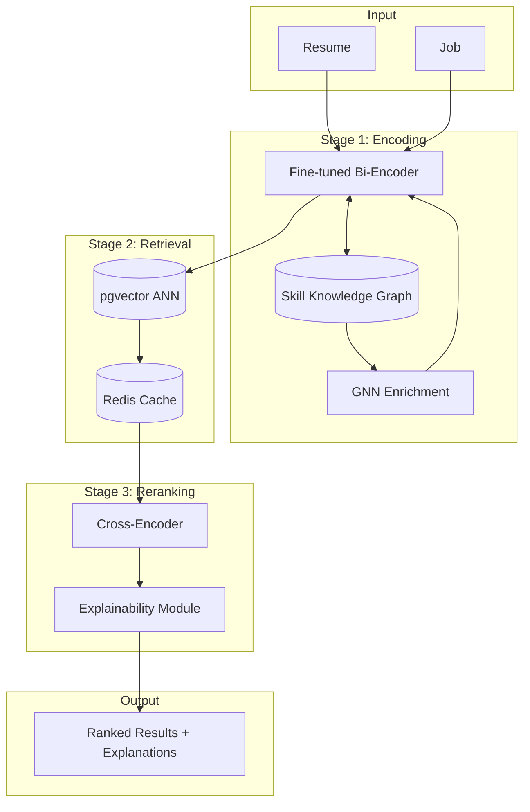
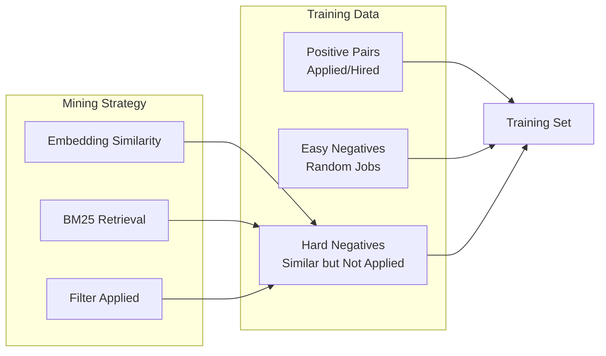
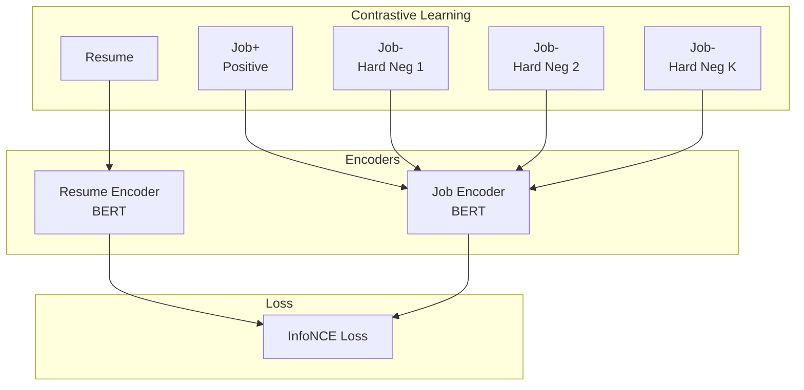
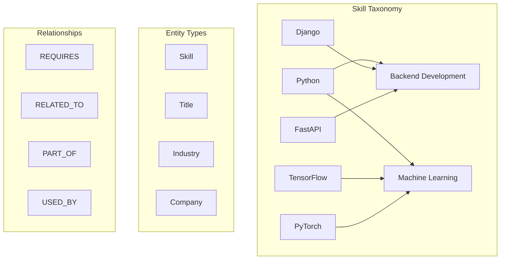
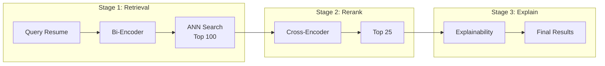
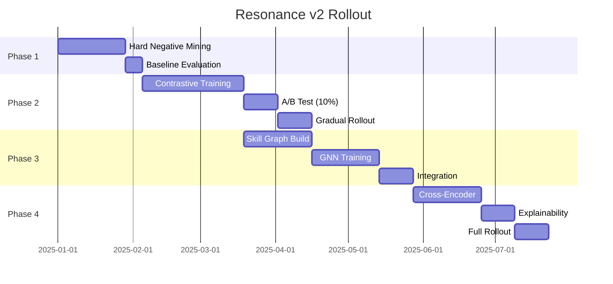

# High-Level Design: Resonance v2 Matching Evolution v1.0

Date: 2025-12-01
Status: Draft
Authors: AIgen Engineering Team

## Executive Summary

Resonance v1 utilizes a bi-encoder architecture with pre-trained embeddings and weighted similarity metrics (L2 + Cosine + Inner Product). While effective, recent academic research demonstrates significant improvements through contrastive learning, knowledge graphs, and hybrid retrieval-reranking architectures.

This HLD proposes a phased evolution to Resonance v2, targeting **+20-30% improvement in nDCG@10** while maintaining sub-100ms latency. The roadmap spans four phases: hard negative mining, contrastive fine-tuning, skill knowledge graphs, and hybrid reranking.

## Goals and Non-Goals

### Goals
- Improve matching accuracy (nDCG@10) by 20-30% over current baseline
- Maintain P99 latency under 100ms for retrieval
- Enable cold-start handling for new jobs/resumes
- Capture transitive skill relationships (Python → Django → Backend)
- Provide explainable match scores to end users

### Non-Goals
- Real-time model training (batch training is acceptable)
- Multi-language support (English-first, others deferred)
- Salary prediction or negotiation features
- Full replacement of PostgreSQL/pgvector infrastructure

## Current State Analysis

### Resonance v1 Architecture

```
┌─────────────┐     ┌─────────────┐
│   Resume    │     │     Job     │
└──────┬──────┘     └──────┬──────┘
       │                   │
       ▼                   ▼
┌─────────────┐     ┌─────────────┐
│  Embedding  │     │  Embedding  │
│  (1024-dim) │     │  (1024-dim) │
└──────┬──────┘     └──────┬──────┘
       │                   │
       └────────┬──────────┘
                │
                ▼
┌───────────────────────────────┐
│  Weighted Similarity Score    │
│  0.4×L2 + 0.4×Cos + 0.2×IP   │
└───────────────────────────────┘
```

### Current Limitations

| Limitation | Impact | Root Cause |
|------------|--------|------------|
| No fine-tuning | Medium accuracy | Using generic embeddings |
| No hard negatives | False positives | All non-matches treated equally |
| No skill graph | Misses related skills | Flat vector space |
| Bi-encoder only | Accuracy ceiling | No cross-attention |

## Architecture

### Target State: Resonance v2



### Components

**Component 1: Contrastive Bi-Encoder**
- Responsibility: Generate semantically-rich embeddings via contrastive learning
- Interfaces: `encode(text) → vector[1024]`
- Dependencies: BERT-base, training pipeline, hard negative sampler

**Component 2: Skill Knowledge Graph**
- Responsibility: Store skill taxonomy and relationships
- Interfaces: `get_related_skills(skill) → List[Skill]`, `get_skill_embedding(skill) → vector`
- Dependencies: Neo4j or PostgreSQL with graph extension, skill extraction pipeline

**Component 3: GNN Enrichment Layer**
- Responsibility: Propagate skill information through graph structure
- Interfaces: `enrich_embedding(base_embedding, entity_id) → enriched_embedding`
- Dependencies: PyTorch Geometric, Skill Knowledge Graph

**Component 4: Cross-Encoder Reranker**
- Responsibility: High-precision reranking of top-K candidates
- Interfaces: `rerank(resume, jobs[]) → scored_jobs[]`
- Dependencies: Fine-tuned BERT cross-encoder

**Component 5: Explainability Module**
- Responsibility: Generate human-readable match explanations
- Interfaces: `explain(resume, job, score) → Explanation`
- Dependencies: Attention weights, skill overlap analysis

## Phase Implementation

### Phase 1: Hard Negative Mining (Foundation)

**Objective**: Improve training signal quality without changing inference architecture.



**Hard Negative Mining Strategies:**

1. **BM25 Hard Negatives**: Jobs that match keywords but weren't applied to
2. **Embedding Hard Negatives**: Top-K similar jobs (by current model) not in positive set
3. **In-Batch Negatives**: O(B²) pairs per batch via contrastive loss

**Data Requirements:**
- Positive pairs: Resume-Job with application/hire signal
- Minimum dataset: 10K positive pairs recommended
- Hard negative ratio: 1:5 to 1:10 (positive:negative)

**Implementation:**

```python
class HardNegativeMiner:
    def __init__(self, encoder, bm25_index):
        self.encoder = encoder
        self.bm25 = bm25_index

    def mine(self, resume: str, positive_jobs: List[str], k: int = 10) -> List[str]:
        # BM25 candidates
        bm25_candidates = self.bm25.search(resume, top_k=k*2)

        # Embedding candidates
        resume_emb = self.encoder.encode(resume)
        emb_candidates = self.vector_search(resume_emb, top_k=k*2)

        # Filter out positives
        candidates = set(bm25_candidates + emb_candidates) - set(positive_jobs)

        # Return hardest negatives (highest similarity to resume)
        return self.rank_by_similarity(resume_emb, list(candidates))[:k]
```

**Deliverables:**
- Hard negative mining pipeline
- Training dataset with mined negatives
- Baseline metrics on validation set

---

### Phase 2: Contrastive Fine-Tuning

**Objective**: Fine-tune bi-encoder with contrastive learning for domain-specific embeddings.



**Loss Function:**

```python
def info_nce_loss(resume_emb, job_embs, temperature=0.07):
    """
    resume_emb: [batch_size, dim]
    job_embs: [batch_size, 1+num_negatives, dim]  # First is positive
    """
    # Compute similarities
    similarities = torch.matmul(resume_emb.unsqueeze(1), job_embs.transpose(-2, -1))
    similarities = similarities.squeeze(1) / temperature

    # Labels: first job is always positive
    labels = torch.zeros(batch_size, dtype=torch.long)

    return F.cross_entropy(similarities, labels)
```

**Data Augmentation:**

| Technique | Description | Use Case |
|-----------|-------------|----------|
| Paraphrasing (LLM) | ChatGPT rewrites sections | Semantic diversity |
| EDA | Insert/delete/swap words | Syntactic robustness |
| Skill Masking | Randomly mask skills | Generalization |
| Section Dropout | Drop resume sections | Partial matching |

**Training Configuration:**

```yaml
model:
  base: bert-base-uncased
  pooling: mean
  projection_dim: 1024

training:
  batch_size: 64
  learning_rate: 2e-5
  epochs: 10
  warmup_ratio: 0.1
  hard_negatives_per_positive: 7
  temperature: 0.07

augmentation:
  paraphrase_prob: 0.3
  eda_prob: 0.2
  skill_mask_prob: 0.15
```

**Deliverables:**
- Fine-tuned bi-encoder model
- Training/evaluation pipeline
- Model versioning and A/B test framework
- Expected improvement: +15-20% nDCG@10

---

### Phase 3: Skill Knowledge Graph + GNN

**Objective**: Capture transitive skill relationships via graph structure.



**Knowledge Graph Schema:**

```sql
-- Nodes
CREATE TABLE kg_skills (
    id UUID PRIMARY KEY,
    name VARCHAR(255) UNIQUE,
    category VARCHAR(100),
    embedding VECTOR(256),
    popularity_score FLOAT
);

CREATE TABLE kg_titles (
    id UUID PRIMARY KEY,
    name VARCHAR(255),
    normalized_name VARCHAR(255),
    level VARCHAR(50)  -- junior, mid, senior, lead
);

-- Edges
CREATE TABLE kg_skill_relations (
    source_id UUID REFERENCES kg_skills(id),
    target_id UUID REFERENCES kg_skills(id),
    relation_type VARCHAR(50),  -- RELATED_TO, REQUIRES, PART_OF
    weight FLOAT,
    PRIMARY KEY (source_id, target_id, relation_type)
);

CREATE TABLE kg_title_skills (
    title_id UUID REFERENCES kg_titles(id),
    skill_id UUID REFERENCES kg_skills(id),
    importance FLOAT,  -- 0-1, how important is this skill for the title
    PRIMARY KEY (title_id, skill_id)
);
```

**GNN Architecture:**

```python
import torch
from torch_geometric.nn import GCNConv, GATConv

class SkillGNN(torch.nn.Module):
    def __init__(self, in_dim=256, hidden_dim=256, out_dim=256, heads=4):
        super().__init__()
        self.conv1 = GATConv(in_dim, hidden_dim, heads=heads)
        self.conv2 = GATConv(hidden_dim * heads, out_dim, heads=1)

    def forward(self, x, edge_index):
        x = F.relu(self.conv1(x, edge_index))
        x = F.dropout(x, p=0.2, training=self.training)
        x = self.conv2(x, edge_index)
        return x

class EnrichedEncoder(torch.nn.Module):
    def __init__(self, text_encoder, skill_gnn, skill_extractor):
        super().__init__()
        self.text_encoder = text_encoder
        self.skill_gnn = skill_gnn
        self.skill_extractor = skill_extractor
        self.fusion = nn.Linear(1024 + 256, 1024)

    def forward(self, text):
        # Base text embedding
        text_emb = self.text_encoder(text)  # [batch, 1024]

        # Extract skills and get graph embeddings
        skills = self.skill_extractor(text)  # List of skill IDs
        skill_embs = self.skill_gnn.get_embeddings(skills)  # [batch, 256]

        # Fusion
        combined = torch.cat([text_emb, skill_embs], dim=-1)
        return self.fusion(combined)
```

**Skill Extraction Pipeline:**

1. **NER-based**: Fine-tuned BERT for skill entity recognition
2. **Taxonomy Matching**: Fuzzy match against known skill list (~3000 skills)
3. **LLM Extraction**: GPT-4 for implicit skill inference (batch, offline)

**Deliverables:**
- Skill knowledge graph with 3000+ skills
- GNN model for skill embedding enrichment
- Skill extraction pipeline
- Expected improvement: +5-10% nDCG@10 (cumulative: +20-30%)

---

### Phase 4: Hybrid Reranking

**Objective**: Maximize precision on top-K results with cross-encoder.



**Cross-Encoder Architecture:**

```python
class CrossEncoder(torch.nn.Module):
    def __init__(self, model_name='bert-base-uncased'):
        super().__init__()
        self.bert = AutoModel.from_pretrained(model_name)
        self.classifier = nn.Linear(768, 1)

    def forward(self, resume_text, job_text):
        # Concatenate with [SEP] token
        inputs = self.tokenizer(
            resume_text, job_text,
            padding=True, truncation=True,
            max_length=512, return_tensors='pt'
        )

        outputs = self.bert(**inputs)
        cls_embedding = outputs.last_hidden_state[:, 0, :]
        score = torch.sigmoid(self.classifier(cls_embedding))
        return score
```

**Latency Budget:**

| Stage | Latency | Cumulative |
|-------|---------|------------|
| Bi-Encoder (cached) | 5ms | 5ms |
| ANN Search (100) | 15ms | 20ms |
| Cross-Encoder (100) | 50ms | 70ms |
| Explainability | 10ms | 80ms |
| **Total** | - | **<100ms P99** |

**Explainability Output:**

```json
{
  "job_id": "550e8400-e29b-41d4-a716-446655440000",
  "score": 0.94,
  "explanation": {
    "skill_match": {
      "matched": ["Python", "FastAPI", "PostgreSQL"],
      "missing": ["Kubernetes"],
      "related": ["Docker → Kubernetes (0.7 similarity)"]
    },
    "experience_match": {
      "required": "3-5 years",
      "candidate": "4 years",
      "score": 0.95
    },
    "location_match": {
      "job": "Berlin, Germany",
      "candidate": "Remote OK",
      "score": 1.0
    }
  }
}
```

**Deliverables:**
- Cross-encoder reranking model
- Explainability module
- End-to-end pipeline integration
- Expected improvement: +3-5% nDCG@10 (cumulative: +25-35%)

---

## Data Model

### New Tables

```sql
-- Model versioning
CREATE TABLE ml_models (
    id UUID PRIMARY KEY,
    name VARCHAR(100),
    version VARCHAR(50),
    model_type VARCHAR(50),  -- bi-encoder, cross-encoder, gnn
    artifact_path TEXT,
    metrics JSONB,
    is_active BOOLEAN DEFAULT FALSE,
    created_at TIMESTAMP DEFAULT NOW()
);

-- Training runs
CREATE TABLE ml_training_runs (
    id UUID PRIMARY KEY,
    model_id UUID REFERENCES ml_models(id),
    config JSONB,
    metrics JSONB,
    started_at TIMESTAMP,
    completed_at TIMESTAMP,
    status VARCHAR(20)
);

-- A/B test assignments
CREATE TABLE ab_test_assignments (
    user_id UUID,
    experiment_name VARCHAR(100),
    variant VARCHAR(50),
    assigned_at TIMESTAMP DEFAULT NOW(),
    PRIMARY KEY (user_id, experiment_name)
);
```

### Embedding Migration

```sql
-- Add new embedding column for v2 model
ALTER TABLE jobs ADD COLUMN embedding_v2 VECTOR(1024);

-- Create index for new embeddings
CREATE INDEX idx_jobs_embedding_v2_hnsw
ON jobs USING hnsw (embedding_v2 vector_cosine_ops)
WITH (m = 16, ef_construction = 64);
```

## API Design

### New Endpoints

**POST /v2/jobs/match**

Request:
```json
{
  "resume_id": "uuid",
  "filters": {
    "country": "Germany",
    "experience": "Senior-level",
    "remote_only": true
  },
  "options": {
    "explain": true,
    "model_version": "v2.1.0"
  }
}
```

Response:
```json
{
  "jobs": [
    {
      "id": "uuid",
      "score": 0.94,
      "explanation": { ... }
    }
  ],
  "model_version": "v2.1.0",
  "latency_ms": 78
}
```

**GET /v2/models/active**

Response:
```json
{
  "bi_encoder": "v2.1.0",
  "cross_encoder": "v1.0.0",
  "skill_gnn": "v1.2.0"
}
```

## Testing Strategy

**Unit Tests:**
- Hard negative miner correctness
- Contrastive loss computation
- GNN forward pass
- Cross-encoder scoring

**Integration Tests:**
- End-to-end matching pipeline
- Model loading and versioning
- A/B test assignment

**Evaluation Metrics:**
- nDCG@10, nDCG@25
- MRR (Mean Reciprocal Rank)
- Recall@K
- Latency percentiles (P50, P95, P99)

**Offline Evaluation:**
```python
def evaluate_model(model, test_set):
    metrics = {
        'ndcg@10': [],
        'mrr': [],
        'recall@25': []
    }

    for resume, positive_jobs, all_jobs in test_set:
        scores = model.score(resume, all_jobs)
        ranked = sorted(zip(all_jobs, scores), key=lambda x: -x[1])

        metrics['ndcg@10'].append(compute_ndcg(ranked, positive_jobs, k=10))
        metrics['mrr'].append(compute_mrr(ranked, positive_jobs))
        metrics['recall@25'].append(compute_recall(ranked, positive_jobs, k=25))

    return {k: np.mean(v) for k, v in metrics.items()}
```

**Coverage Target:** 85% on new components

## Monitoring and Observability

**Metrics:**

| Metric | Description | Alert Threshold |
|--------|-------------|-----------------|
| `matching.latency_p99` | End-to-end latency | > 150ms |
| `matching.ndcg_10` | Offline nDCG@10 | < 0.65 |
| `model.inference_errors` | Model failures | > 1% |
| `cache.hit_rate` | Embedding cache hits | < 80% |
| `gnn.propagation_time` | GNN enrichment time | > 20ms |

**Dashboards:**
- Model performance over time
- A/B test results
- Latency breakdown by stage
- Skill graph coverage

## Performance Considerations

**Requirements:**
- Response time: < 100ms P99
- Throughput: 1000 req/s
- Model size: < 500MB per model

**Optimizations:**

| Optimization | Impact | Implementation |
|--------------|--------|----------------|
| Embedding cache | -50ms | Redis with 1h TTL |
| ONNX inference | -30% latency | Export models to ONNX |
| Batch cross-encoder | -40% latency | Process 100 jobs in one forward pass |
| Quantized models | -50% memory | INT8 quantization |

## Risks and Mitigations

| Risk | Impact | Likelihood | Mitigation |
|------|--------|------------|------------|
| Training data insufficient | High | Medium | Start with synthetic augmentation |
| Latency budget exceeded | High | Medium | Aggressive caching, reduce top-K |
| Model regression | High | Low | A/B testing, gradual rollout |
| Skill graph incomplete | Medium | High | Start with top 1000 skills, expand |
| Cold start for new users | Medium | Medium | Fallback to v1 embeddings |

## Rollout Strategy



## Open Questions

- [ ] Which base model? BERT-base vs DistilBERT vs domain-specific (JobBERT)?
- [ ] Skill taxonomy source? ESCO, O*NET, or custom?
- [ ] Cross-encoder truncation strategy for long resumes?
- [ ] How to handle multi-language skills (Python vs パイソン)?
- [ ] A/B test duration and statistical significance threshold?

## References

- [ConFit: Improving Resume-Job Matching using Data Augmentation and Contrastive Learning](https://arxiv.org/abs/2401.16349) - RecSys 2024
- [LinkSAGE: Optimizing Job Matching Using Graph Neural Networks](https://arxiv.org/html/2402.13430v1) - LinkedIn 2024
- [HRGraph: Leveraging LLMs for HR Data Knowledge Graphs](https://arxiv.org/html/2408.13521) - 2024
- [GNN for Candidate-Job Matching](https://link.springer.com/article/10.1007/s41019-025-00293-y) - 2025
- [Sentence-BERT: Sentence Embeddings using Siamese BERT-Networks](https://arxiv.org/abs/1908.10084)
- [DPR: Dense Passage Retrieval for Open-Domain Question Answering](https://arxiv.org/abs/2004.04906)
