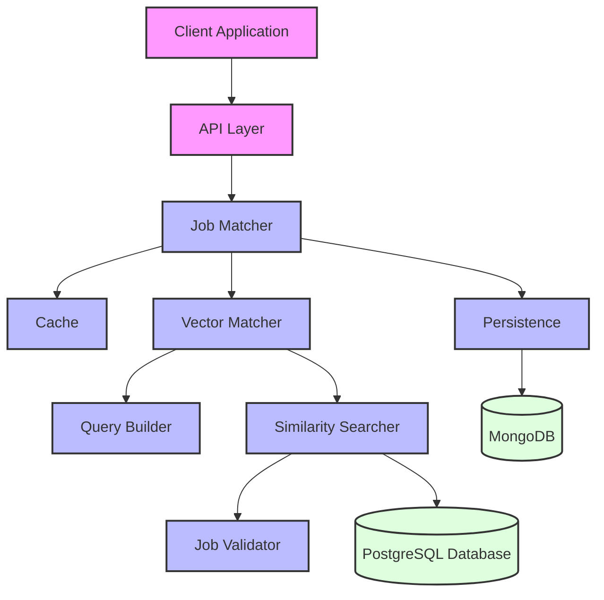
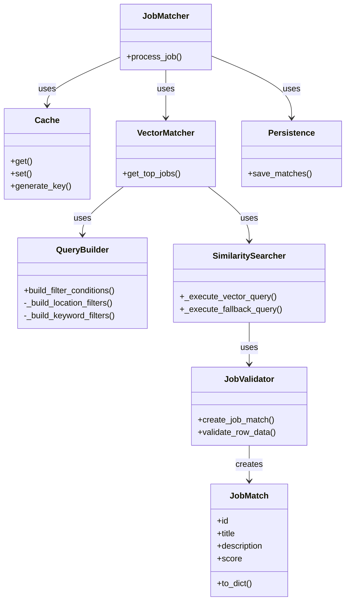
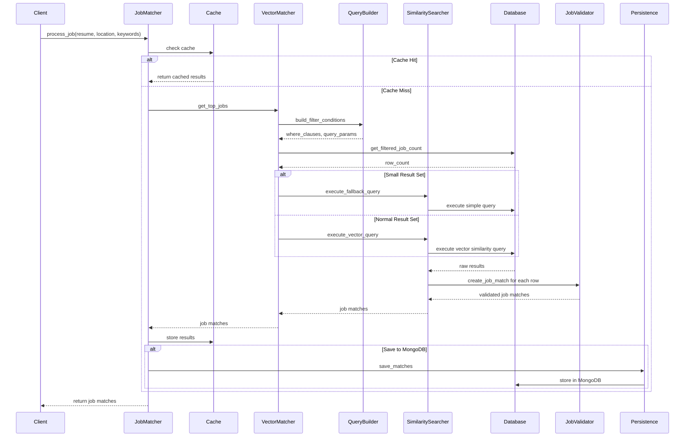
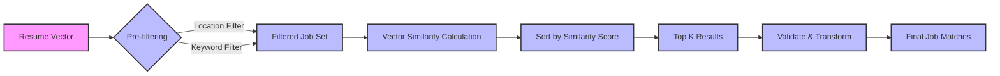
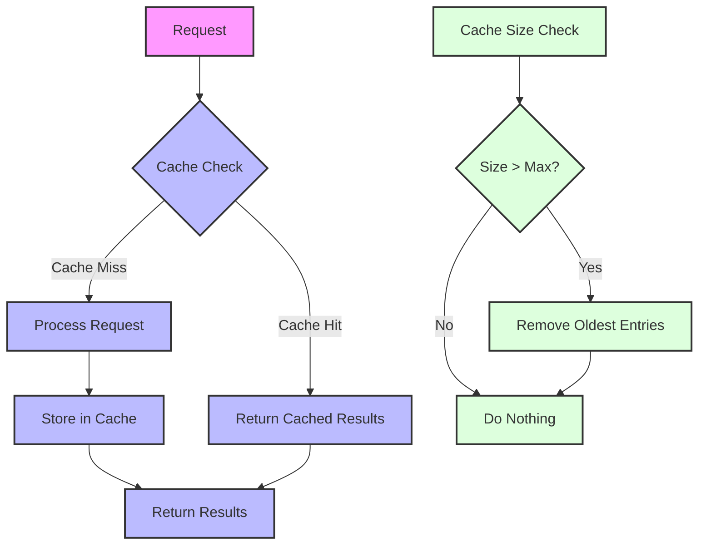

# Job Matcher Component Diagrams

This document provides visual representations of the Job Matcher module's architecture and component interactions.

## High-Level Architecture



## Component Relationships



## Data Flow Diagram



## Vector Similarity Process



## Caching Mechanism



## Error Handling Flow

```mermaid
graph TD
    A[Operation] --> B{Error?}
    B -->|Yes| C[Log Error]
    B -->|No| D[Continue Processing]
    C --> E{Recoverable?}
    E -->|Yes| F[Apply Recovery Strategy]
    E -->|No| G[Raise Exception]
    F --> D
    
    style A fill:#f9f,stroke:#333,stroke-width:2px
    style B fill:#bbf,stroke:#333,stroke-width:2px
    style C fill:#bbf,stroke:#333,stroke-width:2px
    style D fill:#bbf,stroke:#333,stroke-width:2px
    style E fill:#bbf,stroke:#333,stroke-width:2px
    style F fill:#bbf,stroke:#333,stroke-width:2px
    style G fill:#faa,stroke:#333,stroke-width:2px