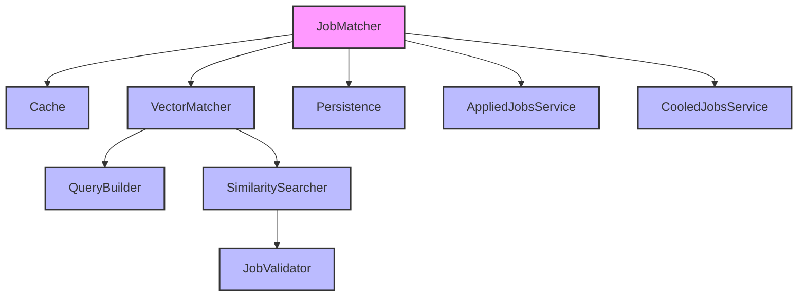
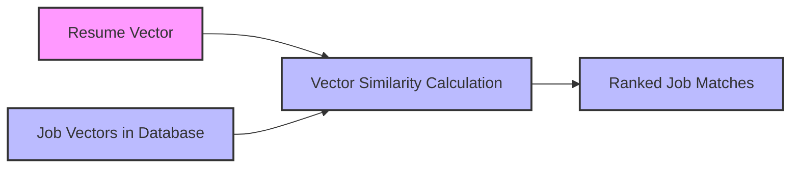
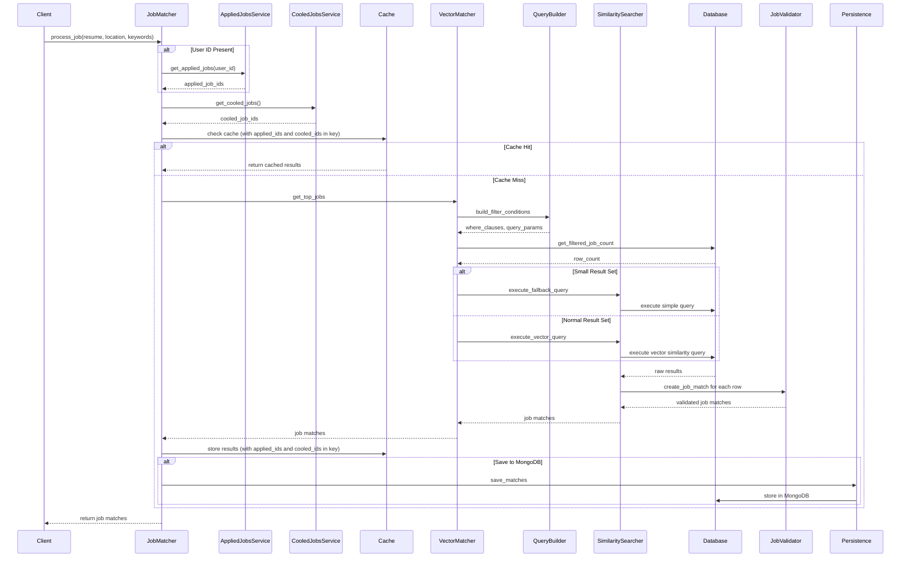

# Job Matcher Technical Documentation

## Table of Contents
1. [Architectural Overview](#architectural-overview)
2. [Component Architecture](#component-architecture)
3. [Algorithmic Approach](#algorithmic-approach)
4. [Theoretical Foundations](#theoretical-foundations)
5. [Algorithm Selection Justification](#algorithm-selection-justification)
6. [Data Flow Visualization](#data-flow-visualization)
7. [Edge Cases and Handling](#edge-cases-and-handling)
8. [Optimization Techniques](#optimization-techniques)
9. [Performance Considerations](#performance-considerations)
10. [API Reference](#api-reference)

## Architectural Overview

The Job Matcher module implements a sophisticated vector similarity-based job matching system that efficiently connects resume embeddings with job embeddings. The system is designed with a focus on performance, scalability, and accuracy, employing several optimization techniques including caching, connection pooling, and optimized vector similarity search algorithms.

The architecture follows SOLID principles with clear separation of concerns:

- **Data Validation Layer**: Validates input data and constructs proper data objects
- **Query Construction Layer**: Builds optimized SQL queries with proper filtering
- **Database Interaction Layer**: Executes the actual database operations
- **Vector Matching Layer**: Coordinates the similarity search process
- **Caching Layer**: Provides fast retrieval of previously computed results
- **Persistence Layer**: Handles saving results to various storage systems

## Component Architecture

### Core Components and Responsibilities



#### Component Descriptions

1. **JobMatcher (matcher.py)**
   - Primary entry point for job matching operations
   - Orchestrates the entire matching process
   - Handles caching and result persistence
   - Coordinates filtering of applied and cooled jobs

2. **Cache (cache.py)**
   - Provides caching functionality for job matching results
   - Implements TTL-based expiration and size-based cleanup
   - Thread-safe with async locking mechanism

3. **VectorMatcher (vector_matcher.py)**
   - Coordinates vector similarity matching
   - Decides between optimized vector search and fallback strategies
   - Handles performance monitoring and error reporting

4. **QueryBuilder (query_builder.py)**
   - Constructs SQL queries with proper filtering
   - Handles location and keyword-based filtering
   - Optimizes query structure for performance

5. **SimilaritySearcher (similarity_searcher.py)**
   - Executes database queries for similarity search
   - Implements vector similarity algorithms
   - Provides fallback mechanisms for edge cases

6. **JobValidator (job_validator.py)**
   - Validates job data and constructs JobMatch objects
   - Ensures data integrity and consistency
   - Handles data transformation and normalization

7. **Persistence (persistence.py)**
   - Handles saving results to various storage systems
   - Supports JSON file and MongoDB persistence
   - Provides error handling and logging

8. **AppliedJobsService (applied_jobs_service.py)**
   - Retrieves lists of job IDs a user has already applied for
   - Interacts with the MongoDB `already_applied_jobs` collection
   - Provides filtering data for job matching

9. **CooledJobsService (cooled_jobs_service.py)**
   - Retrieves lists of job IDs that are in the cooling period
   - Interacts with the MongoDB `cooled_jobs` collection
   - Provides filtering data for job matching

## Algorithmic Approach

The job matching system employs vector similarity search as its core algorithm, which operates on the principle of finding the closest vectors in a high-dimensional space. The system uses the following algorithmic approaches:

### Vector Similarity Search

The primary algorithm uses cosine similarity between resume embeddings and job embeddings to find the most relevant matches. The implementation leverages PostgreSQL's vector operations for efficient similarity computation.



### Algorithmic Steps

1. **Vector Extraction**: Extract the vector embedding from the resume
2. **Filter Construction**: Build SQL filter conditions based on location and keywords
3. **Database Query**: Execute a vector similarity query against the database
4. **Result Processing**: Process and validate the results
5. **Fallback Strategy**: Implement a fallback strategy for edge cases

### Query Optimization

The system employs several query optimization techniques:

1. **Pre-filtering**: Apply filters before vector similarity calculation to reduce the search space
2. **Indexed Vector Operations**: Utilize database vector indices for faster similarity computation
3. **Result Limiting**: Limit the number of results to improve performance
4. **Adaptive Strategy**: Choose between vector similarity and simple queries based on result set size

## Theoretical Foundations

The job matching system is built on several theoretical foundations from information retrieval, vector space models, and similarity measures.

### Vector Space Model

The system represents jobs and resumes as vectors in a high-dimensional space, where each dimension corresponds to a feature or attribute. This representation allows for mathematical operations to determine similarity.

### Cosine Similarity

The primary similarity measure used is cosine similarity, which measures the cosine of the angle between two vectors:

$$\text{similarity} = \cos(\theta) = \frac{\mathbf{A} \cdot \mathbf{B}}{|\mathbf{A}||\mathbf{B}|} = \frac{\sum_{i=1}^{n} A_i B_i}{\sqrt{\sum_{i=1}^{n} A_i^2} \sqrt{\sum_{i=1}^{n} B_i^2}}$$

Where:
- $\mathbf{A}$ and $\mathbf{B}$ are the resume and job vectors
- $A_i$ and $B_i$ are the components of these vectors
- $n$ is the dimensionality of the vector space

### Computational Complexity

The computational complexity of the vector similarity search is:

- **Naive approach**: O(n × d), where n is the number of jobs and d is the vector dimension
- **With indexing**: O(log(n) × d) for approximate nearest neighbor search
- **With pre-filtering**: O(m × d), where m is the number of jobs after filtering (m << n)

## Algorithm Selection Justification

The choice of vector similarity search as the primary algorithm is justified by several factors:

### Performance Considerations

1. **Scalability**: Vector similarity search scales well with large datasets when proper indexing is used
2. **Query Speed**: Pre-filtering and indexing allow for fast query execution
3. **Caching**: Caching of results further improves performance for repeated queries

### Accuracy Factors

1. **Semantic Understanding**: Vector embeddings capture semantic relationships between jobs and resumes
2. **Contextual Matching**: The algorithm can match conceptually related terms even if they don't match exactly
3. **Ranking Quality**: The similarity score provides a natural ranking mechanism

### Alternatives Considered

1. **Keyword-Based Search**: Less effective at capturing semantic relationships
2. **Classification Approaches**: Require extensive training data and don't provide fine-grained similarity scores
3. **Graph-Based Approaches**: More complex to implement and maintain

## Data Flow Visualization

The following diagram illustrates the data flow through the job matching system:



## Edge Cases and Handling

The job matching system handles several edge cases to ensure robustness:

### Empty or Invalid Resume Vector

If the resume doesn't contain a valid vector embedding, the system returns an empty result set with appropriate logging.

```python
if "vector" not in resume:
    logger.warning("No vector found in resume")
    return {"jobs": []}
```

### Small Result Sets

For very small result sets (≤ 5 jobs), the system uses a simpler query without vector operations to ensure some results are returned.

```python
if row_count <= 5:
    logger.info("Using fallback strategy due to small result set")
    result = await self.similarity_searcher._execute_fallback_query(...)
```

### Database Connection Failures

The system implements retry logic for database operations to handle transient connection issues.

### Invalid Job Data

The JobValidator component ensures that only valid job data is processed and returned, filtering out incomplete or malformed records.

### Applied and Cooled Jobs Retrieval Failures

If there are errors retrieving applied or cooled job IDs, the system continues without filtering:

```python
try:
    cooled_ids = await cooled_jobs_service.get_cooled_jobs()
except Exception as e:
    logger.error(f"Error fetching cooled job IDs: {e}")
    cooled_ids = None # Proceed without filtering on error
```

### Cache Management

The cache implements size-based cleanup to prevent memory issues:

```python
if len(self._cache) > self._max_size:
    logger.info(f"Cache cleanup triggered (size={len(self._cache)})")
    # Remove oldest entries
    sorted_items = sorted(self._cache.items(), key=lambda x: x[1][1])
    to_remove = len(self._cache) // 2  # Remove half of the entries
```

## Optimization Techniques

The job matching system employs several optimization techniques to ensure high performance and scalability:

### Caching

The system implements a TTL-based cache with size management to improve performance for repeated queries.

### Connection Pooling

Database connections are pooled to reduce the overhead of establishing new connections for each query.

### Query Optimization

1. **Pre-filtering**: Apply filters before vector similarity calculation
2. **Indexed Vector Operations**: Utilize database vector indices
3. **Result Limiting**: Limit the number of results to improve performance

### Adaptive Query Strategy

The system chooses between vector similarity and simple queries based on the expected result set size.

### Asynchronous Processing

All operations are implemented using asynchronous programming to improve throughput and responsiveness.

### Performance Logging

Comprehensive performance logging helps identify bottlenecks and optimize critical paths.

## Performance Considerations

### Computational Complexity Analysis

1. **Vector Similarity Calculation**: O(d) per job, where d is the vector dimension
2. **Database Query with Index**: O(log(n) × d), where n is the number of jobs
3. **Result Processing**: O(k), where k is the number of results

### Scalability Factors

1. **Database Scaling**: The system can scale with the database's ability to handle vector operations
2. **Caching Efficiency**: Caching reduces database load for repeated queries
3. **Connection Pooling**: Reduces the overhead of establishing new connections

### Performance Metrics

The system tracks several performance metrics:

1. **Query Execution Time**: Time taken to execute database queries
2. **Total Processing Time**: End-to-end time for job matching
3. **Cache Hit Rate**: Percentage of requests served from cache
4. **Result Count**: Number of matches found

## API Reference

### JobMatcher

```python
async def process_job(
    self,
    resume: Dict[str, Any],
    location: Optional[LocationFilter] = None,
    keywords: Optional[List[str]] = None,
    save_to_mongodb: bool = False,
    offset: int = 0,
    use_cache: bool = True,
    limit: int = 25,
    experience: Optional[List[str]] = None,
) -> Dict[str, Any]
```

Primary entry point for job matching operations.

### VectorMatcher

```python
async def get_top_jobs(
    self,
    cv_embedding: List[float],
    location: Optional[LocationFilter] = None,
    keywords: Optional[List[str]] = None,
    offset: int = 0,
    limit: int = 25,
    experience: Optional[List[str]] = None,
    applied_job_ids: Optional[List[str]] = None
) -> List[JobMatch]
```

Core vector similarity matching functionality.

### QueryBuilder

```python
def build_filter_conditions(
    self,
    location: Optional[LocationFilter] = None,
    keywords: Optional[List[str]] = None
) -> Tuple[List[str], List[Any]]
```

Builds SQL filter conditions based on location and keywords.

### SimilaritySearcher

```python
async def _execute_vector_query(
    self,
    cursor: Any,
    cv_embedding: List[float],
    where_clauses: List[str],
    query_params: List[Any],
    limit: int,
    offset: int
) -> List[JobMatch]
```

Executes vector similarity query against the database.

### JobValidator

```python
def create_job_match(self, row: dict) -> Optional[JobMatch]
```

Creates a JobMatch instance from a database row dictionary.

### Cache

```python
async def get(self, key: str) -> Optional[Dict[str, Any]]
async def set(self, key: str, results: Dict[str, Any]) -> None
async def generate_key(self, *args, **kwargs) -> str
```

Provides caching functionality for job matching results.

### Persistence

```python
async def save_matches(
    self,
    job_results: Dict[str, Any],
    resume_id: str,
    save_to_mongodb: bool = False
) -> None
```

Handles saving job matches to various storage systems.

### AppliedJobsService

```python
async def get_applied_jobs(user_id: str) -> List[str]
```

Retrieves list of job IDs that a user has already applied for.

### CooledJobsService

```python
async def get_cooled_jobs() -> List[str]
```

Retrieves list of job IDs that are in the cooling period.