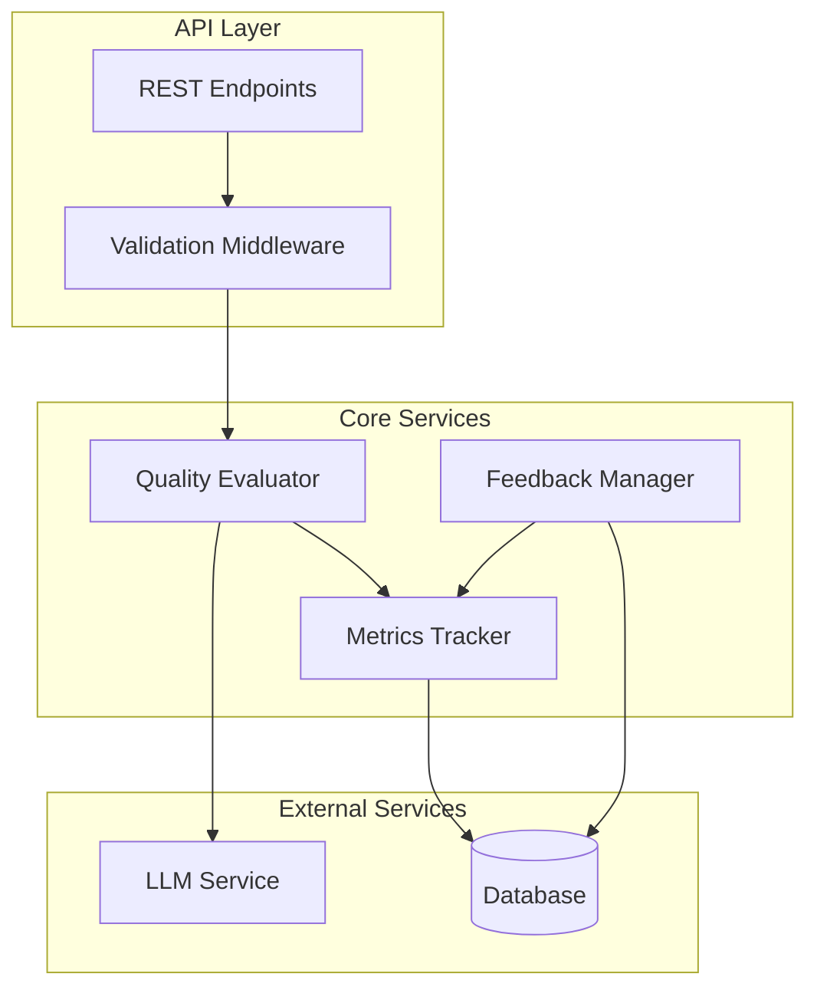
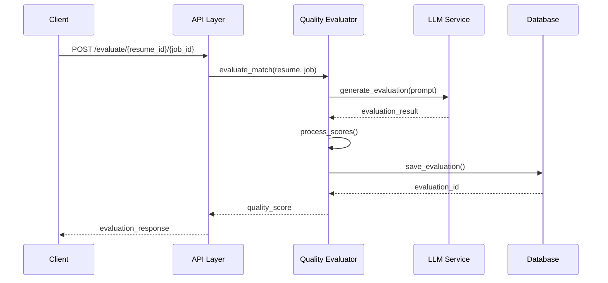
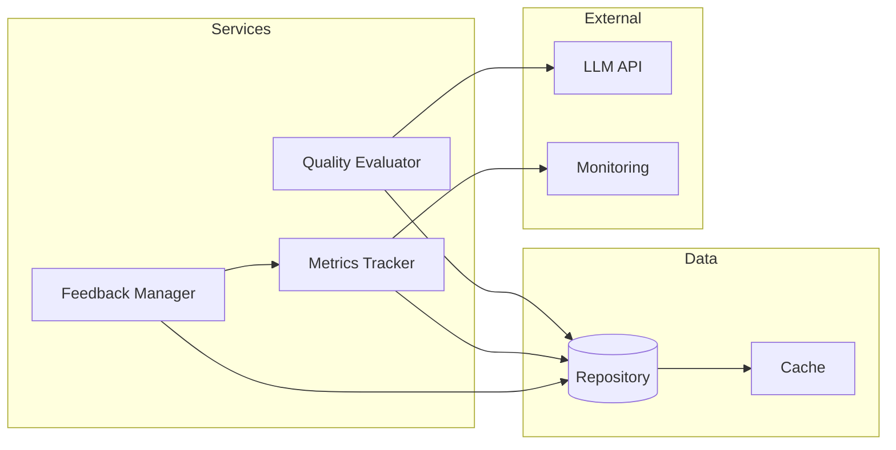

# Quality Tracking System Documentation

## Overview

The quality tracking system provides self-supervised evaluation of resume-job matches using LLMs. It tracks match quality metrics, collects manual feedback, and provides analytics capabilities.

## System Architecture



## Quality Evaluation Flow



## Component Interaction



## Features

- LLM-based quality evaluation
- Comprehensive metrics tracking
- Manual feedback collection
- RESTful API endpoints
- Proper error handling and logging

## System Logic

### 1. Quality Evaluation Process

The system evaluates matches through a multi-step process:

1. **Input Processing**
   ```python
   async def process_input(resume: Dict, job: Dict) -> ProcessedData:
       """
       Preprocesses resume and job data for evaluation.
       - Extracts key information
       - Normalizes text
       - Validates required fields
       """
   ```

2. **LLM Evaluation**
   ```python
   async def evaluate_match(processed_data: ProcessedData) -> EvaluationResult:
       """
       Generates LLM-based evaluation:
       1. Constructs prompt with processed data
       2. Calls LLM API with retry logic
       3. Parses and validates response
       4. Calculates component scores
       """
   ```

3. **Score Calculation**
   ```python
   def calculate_scores(evaluation: Dict) -> QualityScores:
       """
       Calculates various quality scores:
       - Skill alignment (40%)
       - Experience match (40%)
       - Overall fit (20%)
       
       Uses weighted averages and normalization
       """
   ```

4. **Result Storage**
   ```python
   async def store_results(scores: QualityScores) -> str:
       """
       Stores evaluation results:
       1. Saves to database
       2. Updates metrics
       3. Triggers notifications if needed
       """
   ```

### 2. Metrics Tracking Logic

The system tracks metrics at multiple levels:

1. **Individual Metrics**
   - Match quality scores
   - Component scores
   - Processing times
   - LLM response quality

2. **Aggregate Metrics**
   - Score distributions
   - Trend analysis
   - Feedback correlation
   - System performance

3. **Real-time Analytics**
   ```python
   async def track_metrics(metric_data: MetricData):
       """
       Processes and stores metrics:
       1. Calculates derived metrics
       2. Updates running aggregates
       3. Checks thresholds
       4. Triggers alerts if needed
       """
   ```

## Setup

1. Create the database tables:
```bash
python app/scripts/create_quality_tracking_tables.py
```

2. Configure OpenAI API key in your environment:
```bash
export OPENAI_API_KEY=your_api_key_here
```

## API Endpoints

### Evaluate Match Quality

```http
POST /api/v1/quality-tracking/evaluate/{resume_id}/{job_id}
```

Evaluates the quality of a match between a resume and job posting.

Response:
```json
{
    "evaluation_id": "uuid",
    "resume_id": "string",
    "job_id": "string",
    "match_score": 0.85,
    "quality_score": 0.92,
    "skill_alignment_score": 0.90,
    "experience_match_score": 0.95,
    "evaluation_text": "string",
    "created_at": "2024-02-12T20:00:00Z"
}
```

### Submit Feedback

```http
POST /api/v1/quality-tracking/evaluations/{evaluation_id}/feedback
```

Submit feedback for a quality evaluation.

Request:
```json
{
    "feedback_score": 85.5,
    "feedback_text": "Good match but could improve skill alignment",
    "reviewer": "john.doe@example.com"
}
```

### Get Metrics

```http
GET /api/v1/quality-tracking/metrics/{evaluation_id}
```

Retrieve metrics for a specific evaluation.

Parameters:
- `metric_name` (optional): Filter by metric name
- `start_time` (optional): Start time filter
- `end_time` (optional): End time filter

### Get Aggregated Metrics

```http
GET /api/v1/quality-tracking/metrics/aggregated/{metric_name}
```

Retrieve aggregated metrics across all evaluations.

Parameters:
- `start_time` (optional): Start time filter
- `end_time` (optional): End time filter
- `group_by` (optional): Field to group results by

Response:
```json
{
    "overall": {
        "count": 100,
        "average": 85.5,
        "min": 65.0,
        "max": 98.0,
        "std_dev": 8.2
    }
}
```

## Integration Example

```python
from app.services.quality_evaluation_service import OpenAIQualityEvaluator
from app.repositories.quality_tracking_repository import QualityTrackingRepository
from app.services.metrics_tracking_service import QualityMetricsTracker

async def evaluate_match(resume: dict, job: dict, session: AsyncSession):
    # Initialize services
    repository = QualityTrackingRepository(session)
    metrics_tracker = QualityMetricsTracker(session)
    evaluator = OpenAIQualityEvaluator(repository, metrics_tracker)
    
    # Evaluate match
    quality_score = await evaluator.evaluate_match(resume, job)
    
    return quality_score
```

## Best Practices

1. Error Handling:
   - All components include comprehensive error handling
   - Errors are logged with context using loguru
   - API endpoints return appropriate HTTP status codes

2. Logging:
   - Use structured logging with loguru
   - Include relevant context in log messages
   - Log both successful operations and errors

3. Database Operations:
   - Use async SQLAlchemy for all database operations
   - Implement proper transaction management
   - Include indexes for better query performance

4. API Design:
   - Follow RESTful principles
   - Use proper HTTP methods and status codes
   - Include comprehensive documentation
   - Validate input with Pydantic models

## Monitoring

The system tracks several key metrics:

1. Quality Scores:
   - Overall quality score
   - Skill alignment score
   - Experience match score

2. Feedback Metrics:
   - Feedback scores
   - Reviewer agreement rate
   - Time to feedback

3. System Metrics:
   - API response times
   - Error rates
   - Evaluation throughput

## Security Considerations

1. API Security:
   - Use proper authentication
   - Validate all inputs
   - Sanitize outputs
   - Rate limit API endpoints

2. Data Privacy:
   - Handle PII appropriately
   - Implement access controls
   - Audit logging for sensitive operations

## Maintenance

1. Regular Tasks:
   - Monitor error rates
   - Review feedback patterns
   - Update LLM prompts based on feedback
   - Optimize database queries

2. Scaling:
   - Monitor resource usage
   - Optimize batch operations
   - Consider caching for frequently accessed data

## System Improvements

1. Enhanced Evaluation Logic:
   - Implement multi-model consensus scoring
   - Add domain-specific evaluation criteria
   - Include historical performance analysis
   - Develop adaptive scoring weights

2. Performance Optimizations:
   - Add Redis caching layer
   - Implement batch processing
   - Use database materialized views
   - Optimize LLM prompt tokens

3. Advanced Analytics:
   - Add ML-based score prediction
   - Implement anomaly detection
   - Create interactive dashboards
   - Add A/B testing capabilities

4. Feedback Enhancement:
   - Add structured feedback templates
   - Implement automated feedback analysis
   - Create feedback-based learning system
   - Add peer review system

5. Infrastructure:
   - Add service redundancy
   - Implement circuit breakers
   - Add request tracing
   - Enhance monitoring alerts

This documentation provides a comprehensive guide to using and maintaining the quality tracking system. For specific implementation details, refer to the source code and inline documentation.