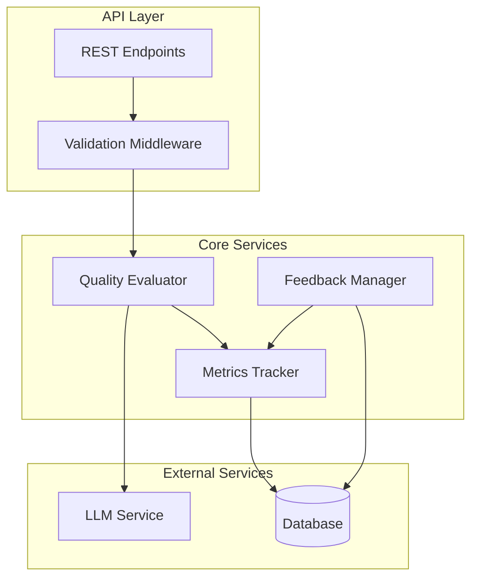
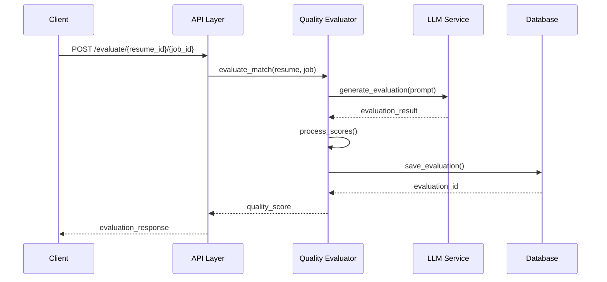
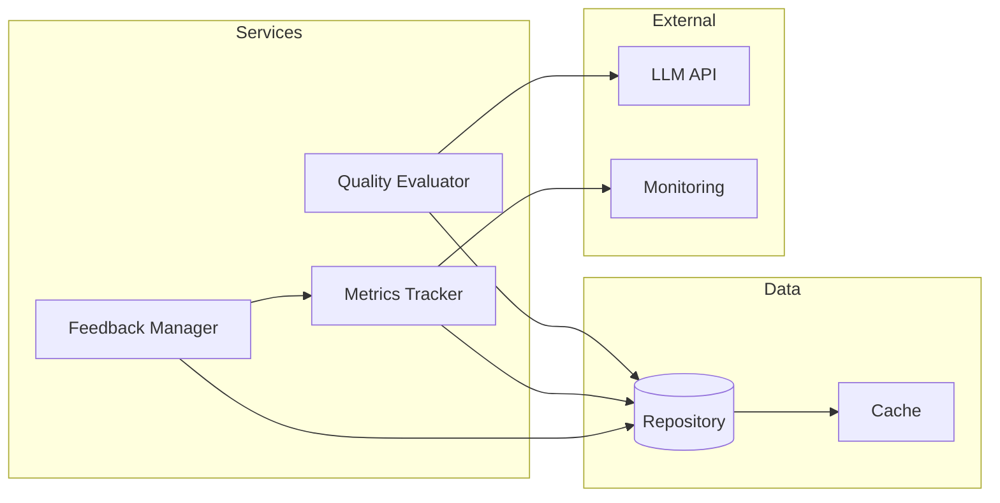

# Quality Tracking System Documentation

## Overview

The quality tracking system provides self-supervised evaluation of resume-job matches using LLMs. It tracks match quality metrics, collects manual feedback, and provides analytics capabilities.

## System Architecture



## Quality Evaluation Flow



## Component Interaction



## Features

- LLM-based quality evaluation
- Comprehensive metrics tracking
- Manual feedback collection
- RESTful API endpoints
- Proper error handling and logging

## System Logic

### 1. Quality Evaluation Process

The system evaluates matches through a multi-step process:

1. **Input Processing**
   ```python
   async def process_input(resume: Dict, job: Dict) -> ProcessedData:
       """
       Preprocesses resume and job data for evaluation.
       - Extracts key information
       - Normalizes text
       - Validates required fields
       """
   ```

2. **LLM Evaluation**
   ```python
   async def evaluate_match(processed_data: ProcessedData) -> EvaluationResult:
       """
       Generates LLM-based evaluation:
       1. Constructs prompt with processed data
       2. Calls LLM API with retry logic
       3. Parses and validates response
       4. Calculates component scores
       """
   ```

3. **Score Calculation**
   ```python
   def calculate_scores(evaluation: Dict) -> QualityScores:
       """
       Calculates various quality scores:
       - Skill alignment (40%)
       - Experience match (40%)
       - Overall fit (20%)
       
       Uses weighted averages and normalization
       """
   ```

4. **Result Storage**
   ```python
   async def store_results(scores: QualityScores) -> str:
       """
       Stores evaluation results:
       1. Saves to database
       2. Updates metrics
       3. Triggers notifications if needed
       """
   ```

### 2. Metrics Tracking Logic

The system tracks metrics at multiple levels:

1. **Individual Metrics**
   - Match quality scores
   - Component scores
   - Processing times
   - LLM response quality

2. **Aggregate Metrics**
   - Score distributions
   - Trend analysis
   - Feedback correlation
   - System performance

3. **Real-time Analytics**
   ```python
   async def track_metrics(metric_data: MetricData):
       """
       Processes and stores metrics:
       1. Calculates derived metrics
       2. Updates running aggregates
       3. Checks thresholds
       4. Triggers alerts if needed
       """
   ```

## Setup

1. Create the database tables:
```bash
python app/scripts/create_quality_tracking_tables.py
```

2. Configure OpenAI API key in your environment:
```bash
export OPENAI_API_KEY=your_api_key_here
```

## API Endpoints

### Evaluate Match Quality

```http
POST /api/v1/quality-tracking/evaluate/{resume_id}/{job_id}
```

Evaluates the quality of a match between a resume and job posting.

Response:
```json
{
    "evaluation_id": "uuid",
    "resume_id": "string",
    "job_id": "string",
    "match_score": 0.85,
    "quality_score": 0.92,
    "skill_alignment_score": 0.90,
    "experience_match_score": 0.95,
    "evaluation_text": "string",
    "created_at": "2024-02-12T20:00:00Z"
}
```

### Submit Feedback

```http
POST /api/v1/quality-tracking/evaluations/{evaluation_id}/feedback
```

Submit feedback for a quality evaluation.

