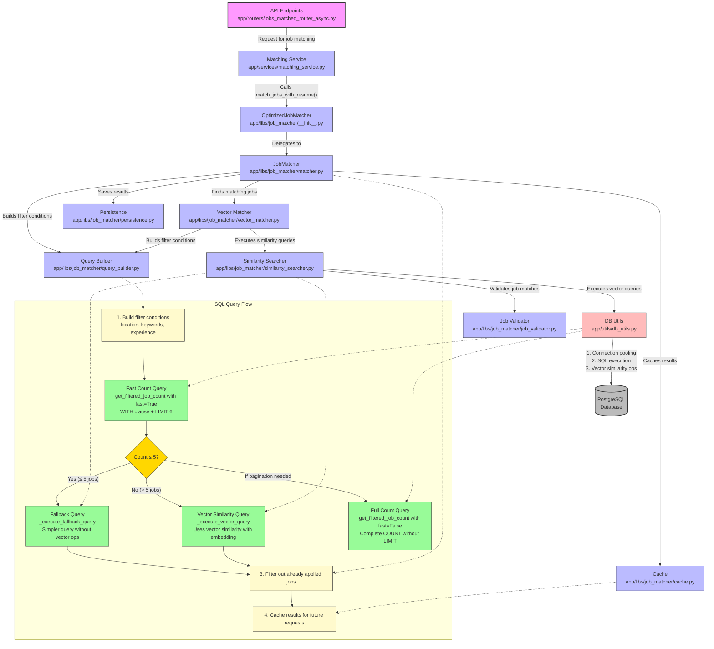

# SQL Query Flow Diagram

This diagram illustrates the flow of SQL queries in the matching service project, showing how job matching requests are processed from API endpoints to database queries, including the different query paths based on result count.

The diagram shows:

1. **Request Flow**: Starting from API endpoints, requests flow through the matching service to the job matcher components.

2. **Component Interactions**: How different components interact with each other:
   - JobMatcher uses QueryBuilder, VectorMatcher, Cache, and Persistence
   - VectorMatcher uses SimilaritySearcher and QueryBuilder
   - SimilaritySearcher uses DB Utils and JobValidator

3. **SQL Query Flow**: The detailed query process including:
   - Building filter conditions
   - **Fast Count Query**: Quick check if there are more than 5 matching jobs (in `app/utils/db_utils.py`, `get_filtered_job_count` with `fast=True`)
   - Decision point based on count results:
     - If count ≤ 5: Use **Fallback Query** (in `app/libs/job_matcher/similarity_searcher.py`, `_execute_fallback_query` method)
     - If count > 5: Use **Vector Similarity Query** (in `app/libs/job_matcher/similarity_searcher.py`, `_execute_vector_query` method)
   - **Full Count Query**: Used when pagination requires total count (in `app/utils/db_utils.py`, `get_filtered_job_count` with `fast=False`)
   - Filtering out already applied jobs
   - Caching results for future requests

4. **Database Operations**: How DB Utils handles connection pooling, SQL execution, and vector similarity operations with the PostgreSQL database.

5. **Query Optimization Paths**:
   - The system optimizes query execution by using simpler queries for small result sets
   - More complex vector similarity operations are only used when necessary for larger result sets