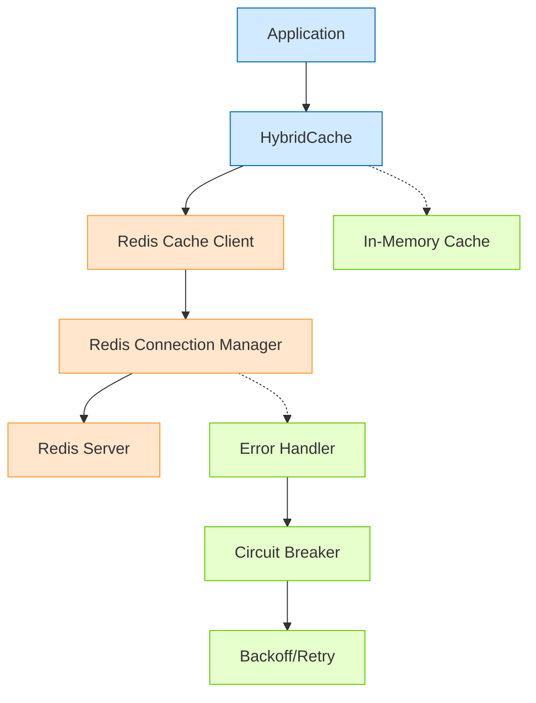
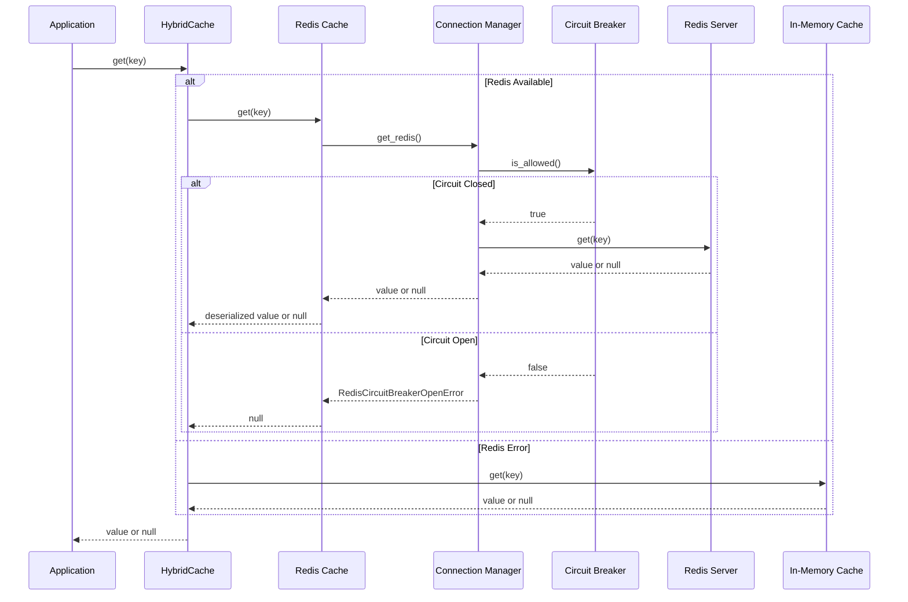
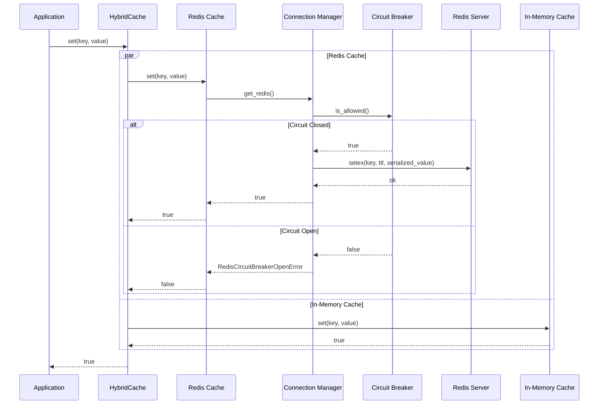
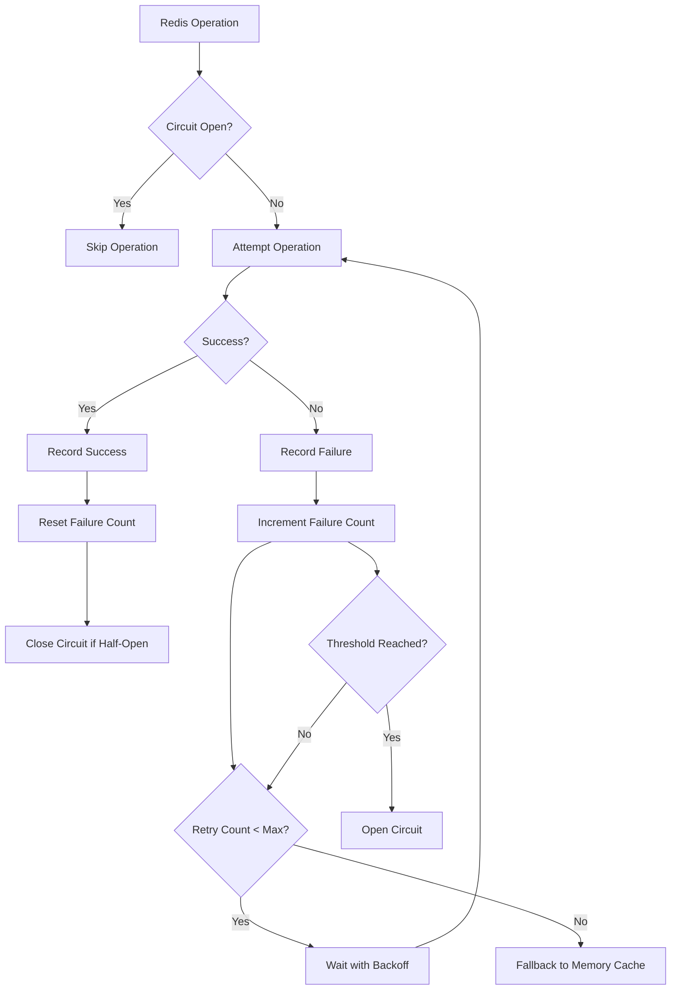

# Redis Caching Architecture

## Overview

The Redis caching solution provides a distributed caching mechanism for the job matching service, replacing the previous in-memory cache with a more robust, scalable solution that works across multiple service replicas.

## Architecture Diagram

## Component Descriptions

### HybridCache
The main cache interface that applications interact with. It automatically routes cache operations to Redis when available, with fallback to in-memory cache when Redis is unavailable.

- **Purpose**: Provide a unified caching interface with fallback mechanisms
- **Responsibilities**:
  - Route cache operations to Redis
  - Fall back to in-memory cache when Redis is unavailable
  - Handle initialization of both cache systems
  - Provide the same API as the original cache

### Redis Cache Client
Handles Redis-specific cache operations including serialization, key management, and TTL handling.

- **Purpose**: Provide Redis-specific caching implementation
- **Responsibilities**:
  - Serialize/deserialize data for Redis storage
  - Manage TTL for cache entries
  - Handle Redis errors with backoff and retry
  - Maintain compatibility with existing cache interface

### Redis Connection Manager
Manages connections to the Redis server with connection pooling and health checking.

- **Purpose**: Manage Redis connections efficiently
- **Responsibilities**:
  - Create and maintain a connection pool
  - Perform periodic health checks
  - Handle connection errors
  - Implement reconnection logic
  - Manage connection lifecycle

### Circuit Breaker
Prevents cascade failures when Redis is unavailable by temporarily stopping Redis operation attempts.

- **Purpose**: Protect the application from Redis failures
- **Responsibilities**:
  - Track connection failures
  - Open circuit (block operations) after failure threshold
  - Automatically attempt recovery after timeout
  - Provide half-open state for testing recovery

### In-Memory Cache
The original in-memory cache implementation, maintained for backward compatibility and fallback.

- **Purpose**: Provide local fallback when Redis is unavailable
- **Responsibilities**:
  - Store cache entries locally
  - Manage TTL and cleanup
  - Maintain the original cache interface

## Sequence Diagrams

### Cache Get Operation

### Cache Set Operation

## Error Handling Flow

## Deployment Considerations

- **Redis Configuration**: Redis server should be configured for high availability
- **Connection Pooling**: Pool size should be adjusted based on instance count and expected load
- **TTL Strategy**: Cache TTL should be configured based on data volatility
- **Memory Monitoring**: Redis memory usage should be monitored to prevent OOM conditions
- **Network Latency**: Redis server should be in the same region as the application to minimize latency