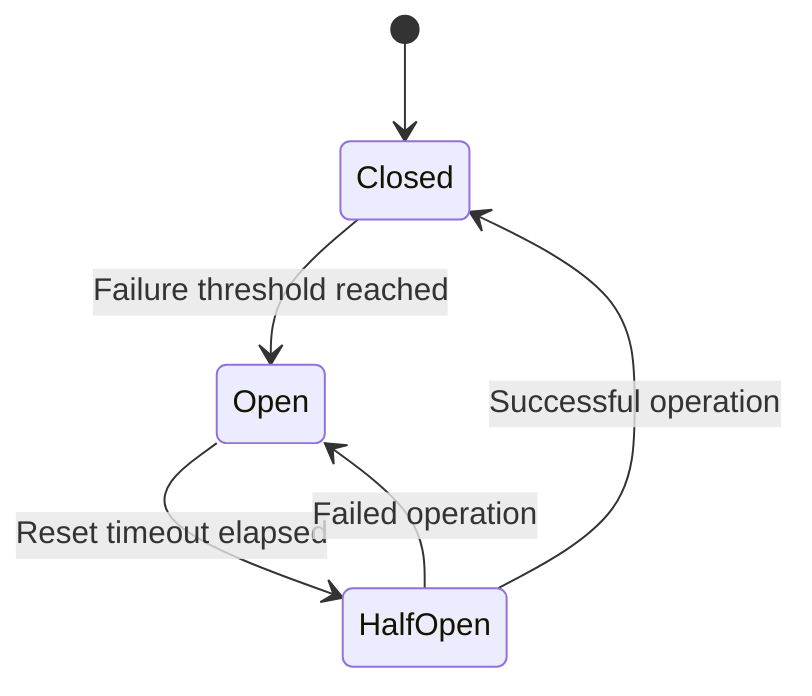
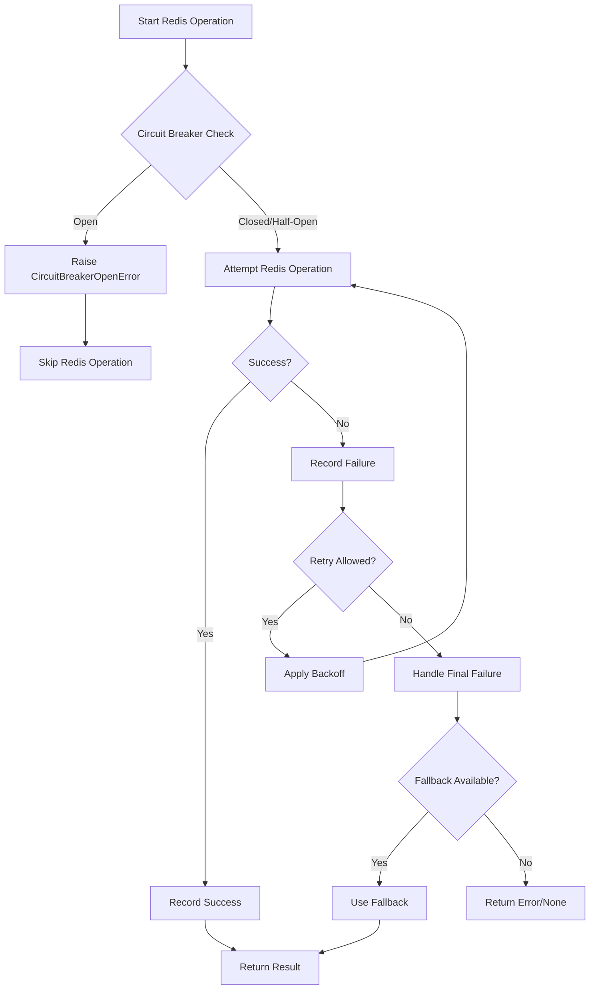

# Redis Cache Error Handling

This document details the error handling strategies implemented in the Redis caching solution to ensure resilience and graceful degradation when Redis becomes unavailable.

## Error Types

The Redis caching implementation handles several types of errors:

### Connection Errors

- **Description**: Failures to connect to the Redis server or connection interruptions.
- **Possible Causes**:
  - Redis server is down
  - Network issues
  - Firewall blocking connections
  - Authentication failures
  - Connection timeouts

### Operation Errors

- **Description**: Errors during Redis operations (get, set, delete).
- **Possible Causes**:
  - Redis server rejecting commands
  - Memory limits reached
  - Permissions issues
  - Operation timeouts

### Serialization Errors

- **Description**: Failures during data serialization or deserialization.
- **Possible Causes**:
  - Data contains non-serializable types
  - Corrupted cache data
  - Version mismatches in stored data

## Error Handling Mechanisms

The Redis caching implementation uses several strategies to handle errors:

### 1. Circuit Breaker Pattern

The circuit breaker prevents cascade failures when Redis is unavailable.



**Implementation Details**:

- Tracks connection failures
- Opens circuit (blocks operations) after threshold reached (default: 5 failures)
- Automatically tests connection after reset timeout (default: 30 seconds)
- Provides half-open state to test recovery
- Resets failure count on successful operations

**Key Components**:
```python
# In circuit_breaker.py
class CircuitBreaker:
    # ...
    
    async def is_allowed(self) -> bool:
        # Check if operation is allowed
        # ...
        
    async def record_success(self):
        # Record successful operation
        # ...
        
    async def record_failure(self):
        # Record failed operation
        # ...
```

### 2. Automatic Retry with Exponential Backoff

For transient errors, operations are automatically retried with increasing delays.

**Implementation Details**:

- Configurable maximum retries (default: 3)
- Exponential backoff with jitter
- Initial backoff of 100ms, doubling with each retry
- Maximum backoff capped at 30 seconds
- Different retry strategies for get vs. set operations

**Example Flow**:
1. Initial operation fails
2. Wait 100ms * jitter
3. Retry operation
4. If fails again, wait 200ms * jitter
5. Retry operation
6. If fails again, wait 400ms * jitter
7. Final retry
8. If all retries fail, return error or fallback

### 3. Fallback to In-Memory Cache

When Redis is unavailable, operations fall back to the in-memory cache.

**Implementation Details**:

- Hybrid cache routes operations to appropriate implementation
- Automatically falls back to in-memory cache on Redis errors
- Maintains backward compatibility
- Preserves data locality for critical operations

**Key Components**:
```python
# In app/libs/job_matcher/cache.py
class HybridCache:
    # ...
    
    async def get(self, key: str) -> Optional[Dict[str, Any]]:
        # Try Redis first if available
        if self._redis_cache is not None:
            try:
                result = await self._redis_cache.get(key)
                if result is not None:
                    return result
            except (RedisCircuitBreakerOpenError, RedisConnectionError):
                # Fall back to memory cache
                # ...
```

### 4. Error Logging and Metrics

Errors are logged and tracked through the metrics system for monitoring and alerting.

**Implementation Details**:

- Detailed error logging with error types and context
- Integration with application metrics system
- Tracking of error rates, circuit breaker state, and retry attempts
- Different log levels based on error severity

## Exception Hierarchy

```
RedisError (base class)
│
├── RedisConnectionError
│   └── (Redis connection failures)
│
├── RedisCircuitBreakerOpenError
│   └── (Circuit breaker preventing operations)
│
├── RedisSerializationError
│   └── (Serialization/deserialization failures)
│
└── RedisOperationError
    └── (Redis operation failures)
```

## Error Handling Flow

The error handling flow for Redis operations follows this sequence:



## Error Handling in Different Components

### Connection Manager

- **Primary Errors**: Connection failures, authentication issues
- **Strategy**: 
  - Circuit breaker
  - Periodic health checks
  - Automatic reconnection
  - Connection pooling

### Cache Client

- **Primary Errors**: Operation failures, timeouts
- **Strategy**:
  - Retry with backoff
  - Error logging
  - Validation of inputs/outputs

### Serialization

- **Primary Errors**: Data format issues, unsupported types
- **Strategy**:
  - Type validation
  - Custom serializers for complex types
  - Graceful handling of corrupted data

## Troubleshooting Guide

### Circuit Breaker Open

**Symptoms**:
- Logs show `RedisCircuitBreakerOpenError`
- Redis operations failing without attempts
- High rate of fallback to memory cache

**Possible Causes**:
- Redis server unreachable
- Network partition
- Authentication failure

**Resolution**:
1. Check Redis server status
2. Verify network connectivity
3. Check authentication credentials
4. Restart Redis if necessary
5. Circuit will automatically attempt to close after timeout

### Serialization Errors

**Symptoms**:
- Logs show `RedisSerializationError`
- Cache misses for specific keys
- Error messages about non-serializable types

**Possible Causes**:
- Data contains non-serializable objects
- Schema/data format changes
- Corrupted cache data

**Resolution**:
1. Review data being cached for non-serializable types
2. Update serialization handlers for new types
3. Clear affected cache entries
4. Add validation before caching

### Connection Errors

**Symptoms**:
- Logs show `RedisConnectionError`
- Slow application performance
- High retry counts

**Possible Causes**:
- Redis server overloaded
- Network issues
- Firewall rules
- Connection limits reached

**Resolution**:
1. Check Redis server metrics
2. Verify network settings
3. Review firewall rules
4. Adjust connection pool settings
5. Scale Redis if necessary

## Best Practices

1. **Monitor Error Rates**: Set up alerts for high error rates or circuit breaker trips
2. **Adjust Thresholds**: Fine-tune circuit breaker and retry parameters based on environment
3. **Test Failure Scenarios**: Regularly test how the application behaves when Redis is unavailable
4. **Plan for Recovery**: Implement procedures for recovering when Redis becomes available again
5. **Log Contextual Information**: Include relevant context in error logs for debugging
6. **Set Appropriate Timeouts**: Configure connection and operation timeouts based on environment
7. **Consider Graceful Degradation**: Design features to work with reduced functionality when Redis is unavailable