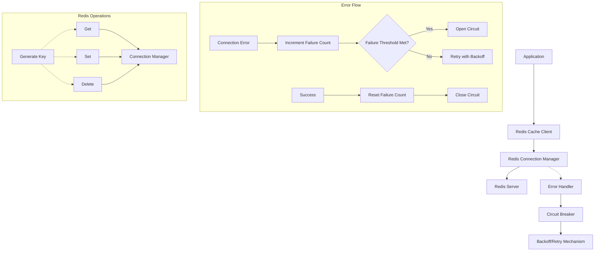

# Redis Caching Solution Plan

## Executive Summary

This document outlines a comprehensive plan for implementing a distributed Redis caching mechanism to replace the current in-memory caching solution in the job matching service. The goal is to provide a robust, resilient, and scalable caching layer that supports multiple service replicas while handling Redis connection failures gracefully.

## 1. Current System Analysis

### 1.1 Existing Cache Implementation

The current system uses a local in-memory cache implementation (`ResultsCache` in app/libs/job_matcher/cache.py) that:

- Stores job matching results with a TTL (default 300 seconds)
- Manages cache size with automatic cleanup (default 1000 entries)
- Uses asyncio locks for thread safety
- Provides key generation from parameters

```python
# Current implementation (simplified)
class ResultsCache:
    def __init__(self, ttl: int = 300, max_size: int = 1000):
        self._cache: Dict[str, Tuple[Dict[str, Any], float]] = {}
        self._ttl = ttl
        self._max_size = max_size
        self._lock = asyncio.Lock()
        
    async def get(self, key: str) -> Optional[Dict[str, Any]]:
        # ... implementation ...
        
    async def set(self, key: str, results: Dict[str, Any]) -> None:
        # ... implementation ...
        
    async def generate_key(self, *args, **kwargs) -> str:
        # ... implementation ...
```

### 1.2 Limitations of Current Approach

- **Replication Issues**: Each service instance maintains its own cache, leading to redundant processing
- **Memory Consumption**: Each instance requires its own memory allocation, inefficient for large datasets
- **Cache Consistency**: No synchronization between replicas, causing potential inconsistencies
- **Restart Penalty**: Cache is lost when service restarts, affecting performance temporarily

### 1.3 Redis Configuration Status

Redis configuration is already present in `config.py`:

```python
# Redis settings
redis_host: str = os.getenv("REDIS_HOST", "localhost")
redis_port: int = os.getenv("REDIS_PORT", 6379)
redis_db: int = os.getenv("REDIS_DB", 0)
redis_password: str = os.getenv("REDIS_PASSWORD", "")
```

## 2. Proposed Solution Architecture



### 2.1 Core Components

#### 2.1.1 Redis Connection Manager

Responsible for handling connections to Redis server, managing connection pooling, and maintaining connection health.

**Key Features:**
- Connection pooling for efficiency
- Automatic reconnection on failure
- Health check mechanism
- Thread-safe connection management
- Support for Redis configuration changes

**Implementation Details:**
```python
class RedisConnectionManager:
    def __init__(self, 
                 host: str, 
                 port: int, 
                 db: int = 0, 
                 password: str = None,
                 max_connections: int = 10,
                 connection_timeout: float = 2.0,
                 health_check_interval: int = 30):
        """
        Initialize Redis connection manager.
        
        Args:
            host: Redis server host
            port: Redis server port
            db: Redis database number
            password: Redis password if required
            max_connections: Maximum connections in the pool
            connection_timeout: Connection timeout in seconds
            health_check_interval: Health check interval in seconds
        """
        self._pool = None
        self._host = host
        self._port = port
        self._db = db
        self._password = password
        self._max_connections = max_connections
        self._connection_timeout = connection_timeout
        self._health_check_interval = health_check_interval
        self._lock = asyncio.Lock()
        self._circuit_breaker = CircuitBreaker()
        
    async def initialize(self):
        """Initialize connection pool"""
        if self._pool is None:
            async with self._lock:
                if self._pool is None:
                    try:
                        # Create connection pool
                        self._pool = await aioredis.create_redis_pool(
                            f'redis://{self._host}:{self._port}',
                            db=self._db,
                            password=self._password,
                            maxsize=self._max_connections,
                            timeout=self._connection_timeout
                        )
                        logger.info("Redis connection pool created successfully")
                        
                        # Start health check task
                        asyncio.create_task(self._health_check_task())
                    except Exception as e:
                        logger.error(f"Failed to create Redis connection pool: {str(e)}")
                        self._circuit_breaker.record_failure()
                        raise
        
    async def get_connection(self):
        """Get a Redis connection from the pool"""
        if not await self._circuit_breaker.is_allowed():
            logger.warning("Circuit breaker is open, Redis operations not allowed")
            raise RedisCircuitBreakerOpenError("Redis circuit breaker is open")
            
        try:
            if self._pool is None:
                await self.initialize()
            return self._pool
        except Exception as e:
            self._circuit_breaker.record_failure()
            logger.error(f"Failed to get Redis connection: {str(e)}")
            raise
    
    async def _health_check_task(self):
        """Periodic health check task"""
        while True:
            await asyncio.sleep(self._health_check_interval)
            await self._perform_health_check()
    
    async def _perform_health_check(self):
        """Perform a health check on the Redis connection"""
        try:
            if self._pool is not None:
                # Simple PING command to check connection
                await self._pool.ping()
                self._circuit_breaker.record_success()
                logger.debug("Redis health check successful")
        except Exception as e:
            self._circuit_breaker.record_failure()
            logger.error(f"Redis health check failed: {str(e)}")
            
            # Try to reinitialize the pool
            self._pool = None
            try:
                await self.initialize()
            except:
                pass  # Already logged in initialize
```

#### 2.1.2 Circuit Breaker

Implements the circuit breaker pattern to prevent cascading failures when Redis is unavailable.

**Key Features:**
- Three states: CLOSED, OPEN, HALF-OPEN
- Automatic state transitions based on failure counts
- Configurable failure threshold and reset timeout
- Thread-safe state management

**Implementation Details:**
```python
class CircuitState(Enum):
    """Circuit breaker states"""
    CLOSED = "CLOSED"       # Normal operation, requests allowed
    OPEN = "OPEN"           # Failure threshold reached, requests blocked
    HALF_OPEN = "HALF_OPEN" # Testing if service is back online

class CircuitBreaker:
    def __init__(self, 
                 failure_threshold: int = 5, 
                 reset_timeout: int = 30):
        """
        Initialize circuit breaker.
        
        Args:
            failure_threshold: Number of failures before opening circuit
            reset_timeout: Time in seconds before attempting to reset circuit
        """
        self._state = CircuitState.CLOSED
        self._failure_count = 0
        self._failure_threshold = failure_threshold
        self._reset_timeout = reset_timeout
        self._last_failure_time = 0
        self._lock = asyncio.Lock()
        
    async def is_allowed(self) -> bool:
        """Check if operation is allowed based on circuit state"""
        async with self._lock:
            now = time.time()
            
            # If circuit is OPEN, check if it's time to try again
            if self._state == CircuitState.OPEN:
                if now - self._last_failure_time >= self._reset_timeout:
                    logger.info("Circuit breaker entering HALF-OPEN state")
                    self._state = CircuitState.HALF_OPEN
                    return True
                return False
                
            # HALF-OPEN or CLOSED states allow operations
            return True
    
    def record_success(self):
        """Record a successful operation"""
        async with self._lock:
            if self._state == CircuitState.HALF_OPEN:
                # Success in HALF-OPEN means service is back
                logger.info("Circuit breaker closing circuit after successful operation")
                self._state = CircuitState.CLOSED
                
            # Reset failure count on success
            self._failure_count = 0
    
    def record_failure(self):
        """Record a failed operation"""
        async with self._lock:
            self._failure_count += 1
            self._last_failure_time = time.time()
            
            if self._state == CircuitState.CLOSED and self._failure_count >= self._failure_threshold:
                logger.warning(f"Circuit breaker opening circuit after {self._failure_count} failures")
                self._state = CircuitState.OPEN
                
            elif self._state == CircuitState.HALF_OPEN:
                logger.warning("Circuit breaker returning to OPEN state after failed test")
                self._state = CircuitState.OPEN
```

#### 2.1.3 Redis Cache Client

Provides a Redis-backed implementation of the cache interface.

**Key Features:**
- Implements the same interface as the current `ResultsCache`
- Handles serialization/deserialization
- Manages TTL in Redis
- Error handling with circuit breaker integration
- Automatic exponential backoff for retries

**Implementation Details:**
```python
class RedisCache:
    def __init__(self, 
                 connection_manager: RedisConnectionManager, 
                 ttl: int = 300,
                 max_retries: int = 3,
                 initial_backoff_ms: int = 100,
                 max_backoff_ms: int = 30000):
        """
        Initialize Redis cache.
        
        Args:
            connection_manager: Redis connection manager
            ttl: Cache TTL in seconds
            max_retries: Maximum number of retry attempts
            initial_backoff_ms: Initial backoff in milliseconds
            max_backoff_ms: Maximum backoff in milliseconds
        """
        self._connection_manager = connection_manager
        self._ttl = ttl
        self._max_retries = max_retries
        self._initial_backoff_ms = initial_backoff_ms
        self._max_backoff_ms = max_backoff_ms
        logger.info(f"Initialized Redis cache with TTL={ttl}s")
        
    async def get(self, key: str) -> Optional[Dict[str, Any]]:
        """
        Get cached results if available and not expired.
        
        Args:
            key: Cache key
            
        Returns:
            Cached results or None if not found or expired
        """
        start_time = time.time()
        retry_count = 0
        backoff_ms = self._initial_backoff_ms
        
        while retry_count <= self._max_retries:
            try:
                redis = await self._connection_manager.get_connection()
                data = await redis.get(key)
                
                if data:
                    # Deserialize data
                    results = json.loads(data)
                    logger.debug(f"Cache hit for key: {key}")
                    elapsed = time.time() - start_time
                    logger.debug(f"Cache retrieval took {elapsed:.6f}s")
                    return results
                
                logger.debug(f"Cache miss for key: {key}")
                return None
                
            except RedisCircuitBreakerOpenError:
                # Circuit breaker is open, don't retry
                logger.warning(f"Circuit breaker open, skipping cache get for key: {key}")
                return None
                
            except Exception as e:
                retry_count += 1
                
                if retry_count > self._max_retries:
                    logger.exception(f"Failed to get cache entry after {retry_count} retries")
                    return None
                
                # Calculate backoff with jitter
                jitter = random.uniform(0.8, 1.2)
                sleep_time = (backoff_ms / 1000.0) * jitter
                
                logger.warning(
                    f"Redis get error (attempt {retry_count}/{self._max_retries}), "
                    f"retrying in {sleep_time:.2f}s: {str(e)}"
                )
                
                await asyncio.sleep(sleep_time)
                
                # Exponential backoff with cap
                backoff_ms = min(backoff_ms * 2, self._max_backoff_ms)
        
        return None
        
    async def set(self, key: str, results: Dict[str, Any]) -> bool:
        """
        Store results in cache.
        
        Args:
            key: Cache key
            results: Results to cache
            
        Returns:
            True if stored successfully, False otherwise
        """
        start_time = time.time()
        retry_count = 0
        backoff_ms = self._initial_backoff_ms
        
        # Serialize data
        try:
            data = json.dumps(results)
        except Exception as e:
            logger.exception(f"Failed to serialize cache data: {str(e)}")
            return False
        
        while retry_count <= self._max_retries:
            try:
                redis = await self._connection_manager.get_connection()
                await redis.setex(key, self._ttl, data)
                
                logger.debug(f"Stored results in cache with key: {key}")
                elapsed = time.time() - start_time
                logger.debug(f"Cache storage took {elapsed:.6f}s")
                return True
                
            except RedisCircuitBreakerOpenError:
                # Circuit breaker is open, don't retry
                logger.warning(f"Circuit breaker open, skipping cache set for key: {key}")
                return False
                
            except Exception as e:
                retry_count += 1
                
                if retry_count > self._max_retries:
                    logger.exception(f"Failed to store cache entry after {retry_count} retries")
                    return False
                
                # Calculate backoff with jitter
                jitter = random.uniform(0.8, 1.2)
                sleep_time = (backoff_ms / 1000.0) * jitter
                
                logger.warning(
                    f"Redis set error (attempt {retry_count}/{self._max_retries}), "
                    f"retrying in {sleep_time:.2f}s: {str(e)}"
                )
                
                await asyncio.sleep(sleep_time)
                
                # Exponential backoff with cap
                backoff_ms = min(backoff_ms * 2, self._max_backoff_ms)
        
        return False
        
    async def generate_key(self, *args, **kwargs) -> str:
        """
        Generate a cache key from arguments.
        
        Args:
            *args: Positional arguments
            **kwargs: Keyword arguments
            
        Returns:
            Cache key string
        """
        key_parts = []
        
        # Add positional args
        for arg in args:
            if arg is not None:
                key_parts.append(str(arg))
        
        # Add keyword args
        for k, v in sorted(kwargs.items()):
            if v is not None:
                if isinstance(v, list):
                    v = sorted(v)
                key_parts.append(f"{k}_{v}")
        
        key = "_".join(str(part) for part in key_parts)
        logger.trace(f"Generated cache key: {key}")
        return key
```

#### 2.1.4 Custom Exceptions

Custom exceptions for Redis operations.

**Implementation Details:**
```python
class RedisError(Exception):
    """Base exception for Redis operations"""
    pass

class RedisConnectionError(RedisError):
    """Exception raised when Redis connection fails"""
    pass

class RedisCircuitBreakerOpenError(RedisError):
    """Exception raised when circuit breaker is open"""
    pass

class RedisSerializationError(RedisError):
    """Exception raised when serialization fails"""
    pass
```

#### 2.1.5 Serialization Utilities

Utilities to handle serialization and deserialization of complex objects.

**Implementation Details:**
```python
class RedisSerializer:
    """Utilities for serializing and deserializing data for Redis"""
    
    @staticmethod
    def serialize(data: Any) -> str:
        """
        Serialize data to a string for Redis storage.
        
        Args:
            data: Data to serialize
            
        Returns:
            Serialized string
        """
        try:
            # Handle special types like datetime, UUID, etc.
            def default(obj):
                if isinstance(obj, datetime):
                    return {"__datetime__": obj.isoformat()}
                if isinstance(obj, UUID):
                    return {"__uuid__": str(obj)}
                raise TypeError(f"Type {type(obj)} not serializable")
            
            return json.dumps(data, default=default)
        except Exception as e:
            logger.exception(f"Serialization error: {str(e)}")
            raise RedisSerializationError(f"Failed to serialize data: {str(e)}")
    
    @staticmethod
    def deserialize(data_str: str) -> Any:
        """
        Deserialize data from Redis.
        
        Args:
            data_str: Serialized data string
            
        Returns:
            Deserialized data
        """
        try:
            # Hook to handle special types
            def object_hook(obj):
                if "__datetime__" in obj:
                    return datetime.fromisoformat(obj["__datetime__"])
                if "__uuid__" in obj:
                    return UUID(obj["__uuid__"])
                return obj
            
            return json.loads(data_str, object_hook=object_hook)
        except Exception as e:
            logger.exception(f"Deserialization error: {str(e)}")
            raise RedisSerializationError(f"Failed to deserialize data: {str(e)}")
```

### 2.2 Initialization and Factory Pattern

Factory for creating Redis cache instances with proper configuration.

**Implementation Details:**
```python
class RedisCacheFactory:
    """Factory for creating Redis cache instances"""
    
    _connection_manager = None
    
    @classmethod
    async def initialize(cls, settings):
        """Initialize the connection manager"""
        if cls._connection_manager is None:
            cls._connection_manager = RedisConnectionManager(
                host=settings.redis_host,
                port=settings.redis_port,
                db=settings.redis_db,
                password=settings.redis_password,
                max_connections=10,
                connection_timeout=2.0,
                health_check_interval=30
            )
            await cls._connection_manager.initialize()
    
    @classmethod
    async def create_cache(cls, settings, ttl=300) -> RedisCache:
        """Create a new Redis cache instance"""
        await cls.initialize(settings)
        return RedisCache(
            connection_manager=cls._connection_manager,
            ttl=ttl,
            max_retries=3,
            initial_backoff_ms=100,
            max_backoff_ms=30000
        )
```

## 3. Implementation Plan

### 3.1 File Structure

```
app/
├── libs/
│   ├── redis/
│   │   ├── __init__.py                # Package exports
│   │   ├── connection.py              # Redis connection management
│   │   ├── circuit_breaker.py         # Circuit breaker implementation
│   │   ├── cache.py                   # Redis cache implementation
│   │   ├── serialization.py           # Serialization utilities
│   │   ├── errors.py                  # Custom exceptions
│   │   ├── factory.py                 # Cache factory
│   │   └── monitoring.py              # Metrics and monitoring
│   └── job_matcher/
│       └── cache.py                   # Updated to use Redis cache
docs/
└── redis_caching/
    ├── architecture.md                # Architecture overview
    ├── configuration.md               # Configuration options
    ├── usage_guide.md                 # Usage examples and best practices
    ├── error_handling.md              # Error handling details
    ├── monitoring.md                  # Monitoring recommendations
    └── performance.md                 # Performance optimization tips
```

### 3.2 Update Existing Code

#### 3.2.1 Replace Singleton Instance in job_matcher/cache.py

```python
# Old implementation (to be replaced)
# Singleton instance
cache = ResultsCache()

# New implementation
from app.libs.redis.factory import RedisCacheFactory
from app.core.config import settings

# This will be initialized in startup event
cache = None

async def initialize_cache():
    """Initialize the Redis cache"""
    global cache
    cache = await RedisCacheFactory.create_cache(settings)
```

#### 3.2.2 Update Imports in Other Files

Review all files importing and using the cache and update as needed.

### 3.3 Add Application Startup/Shutdown Events

```python
# In app/main.py or where FastAPI app is defined

@app.on_event("startup")
async def startup_event():
    """Application startup event"""
    # Initialize Redis cache
    from app.libs.job_matcher.cache import initialize_cache
    await initialize_cache()
    logger.info("Redis cache initialized")

@app.on_event("shutdown")
async def shutdown_event():
    """Application shutdown event"""
    # Close Redis connections
    from app.libs.redis.factory import RedisCacheFactory
    if RedisCacheFactory._connection_manager and hasattr(RedisCacheFactory._connection_manager, "_pool"):
        RedisCacheFactory._connection_manager._pool.close()
        await RedisCacheFactory._connection_manager._pool.wait_closed()
        logger.info("Redis connections closed")
```

## 4. Error Handling Strategy

### 4.1 Connection Failures

1. **Circuit Breaker Pattern**
   - Detect repeated connection failures
   - Open circuit after threshold reached (prevent cascade failures)
   - Automatically attempt to close circuit after reset timeout

2. **Exponential Backoff**
   - Start with small retry delay (100ms)
   - Double delay after each failure
   - Add jitter to prevent thundering herd problem
   - Cap at maximum delay (30s)

3. **Fallback Behavior**
   - Skip caching operations entirely when Redis is unavailable
   - Log errors with appropriate severity
   - Return `None` for `get` operations

### 4.2 Transient Failures

1. **Automatic Retry**
   - Configurable maximum retries (default 3)
   - Apply exponential backoff
   - Proper error logging

2. **Recovery Detection**
   - Health check to detect when Redis is available again
   - Close circuit and resume normal operations

### 4.3 Data Corruption

1. **Serialization Error Handling**
   - Catch and log serialization/deserialization errors
   - Skip caching of problematic data
   - Return `None` for corrupted cache entries

2. **Data Validation**
   - Validate data structure before returning from cache
   - Log anomalies for investigation

## 5. Monitoring and Metrics

### 5.1 Key Metrics to Track

1. **Cache Performance**
   - Hit rate (hits/total requests)
   - Miss rate (misses/total requests)
   - Cache operation latency (get/set)

2. **Redis Health**
   - Connection status
   - Connection failure rate
   - Circuit breaker state changes

3. **Error Rates**
   - Connection failures
   - Serialization errors
   - Circuit breaker trips

### 5.2 Integration with Existing Metrics

Use the existing metrics system to track Redis cache performance.

```python
# Example metrics integration
from app.metrics.core import metrics

# In RedisCache class
async def get(self, key: str) -> Optional[Dict[str, Any]]:
    start_time = time.time()
    try:
        # ... existing implementation ...
        
        if data:
            metrics.increment("redis.cache.hit")
            elapsed = time.time() - start_time
            metrics.timing("redis.cache.get_latency", elapsed * 1000)
            return results
        
        metrics.increment("redis.cache.miss")
        return None
        
    except RedisCircuitBreakerOpenError:
        metrics.increment("redis.circuit_breaker.skip")
        return None
        
    except Exception as e:
        metrics.increment("redis.error")
        # ... error handling ...
```

## 6. Comprehensive Documentation

### 6.1 Architecture Overview (architecture.md)

- High-level architecture diagrams
- Component descriptions and responsibilities
- Sequence diagrams for key operations
- Failure scenarios and recovery paths

### 6.2 Configuration Options (configuration.md)

- Redis connection parameters
- Circuit breaker settings
- Retry and backoff parameters
- Cache TTL and other options
- Environment variable reference

### 6.3 Usage Guide (usage_guide.md)

- Code examples for common scenarios
- Best practices for key generation
- Integration points with existing code
- Performance optimization tips

### 6.4 Error Handling (error_handling.md)

- Common error scenarios
- Troubleshooting guides
- Error codes and meanings
- Recovery procedures

### 6.5 Monitoring (monitoring.md)

- Available metrics
- Alerting recommendations
- Dashboard examples
- Performance baselines

### 6.6 Performance Considerations (performance.md)

- Serialization options
- Key design best practices
- TTL strategies
- Memory usage considerations

## 7. Implementation Sequence

1. **Foundations (Week 1)**
   - Create Redis package structure
   - Implement connection manager
   - Implement circuit breaker
   - Implement basic error handling

2. **Core Functionality (Week 1-2)**
   - Implement Redis cache client
   - Create serialization utilities
   - Write unit tests for components

3. **Integration (Week 2)**
   - Update existing cache usage
   - Implement initialization in app startup
   - Add metrics integration

4. **Testing & Refinement (Week 2-3)**
   - Performance testing
   - Load testing
   - Error scenario testing
   - Documentation review

5. **Documentation & Finalization (Week 3)**
   - Complete comprehensive documentation
   - Code review
   - Final adjustments

## 8. Conclusion

This Redis caching solution will provide a robust, resilient shared caching mechanism for the job matching service. By implementing proper error handling, circuit breaking, and retry mechanisms, the system will gracefully handle Redis unavailability while maintaining performance.

The solution maintains the same interface as the current cache implementation, making integration straightforward while significantly improving scalability and resilience.