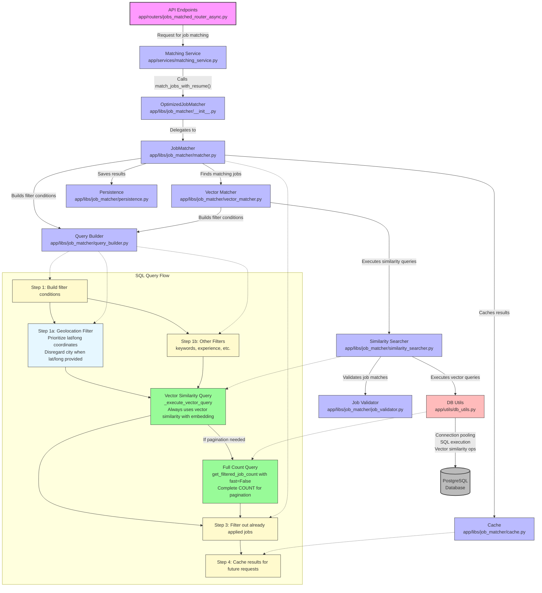

# SQL Query Flow Diagram

This diagram illustrates the flow of SQL queries in the matching service project, showing how job matching requests are processed from API endpoints to database queries, with an emphasis on geolocation prioritization and the streamlined query path.

The diagram shows the following components and flows:

**Request Flow**: Starting from API endpoints, requests flow through the matching service to the job matcher components.

**Component Interactions**: How different components interact with each other:
JobMatcher uses QueryBuilder, VectorMatcher, Cache, and Persistence;
VectorMatcher uses SimilaritySearcher and QueryBuilder;
SimilaritySearcher uses DB Utils and JobValidator.

**SQL Query Flow**: The detailed query process including:
Building filter conditions with prioritized geolocation handling - Latitude and longitude coordinates are prioritized over city names; When latitude and longitude parameters are provided, city parameters are completely disregarded in the WHERE clause.
Vector Similarity Query: Always used for all job matching queries (in app/libs/job_matcher/similarity_searcher.py, _execute_vector_query method).
Full Count Query: Used when pagination requires total count (in app/utils/db_utils.py, get_filtered_job_count with fast=False).
Filtering out already applied jobs.
Caching results for future requests.

**Database Operations**: How DB Utils handles connection pooling, SQL execution, and vector similarity operations with the PostgreSQL database.

**Streamlined Query Path**:
The system now always uses vector similarity operations for all queries;
The previous optimization that used simpler queries for small result sets has been removed;
This simplifies the query flow while ensuring consistent results across all query sizes.